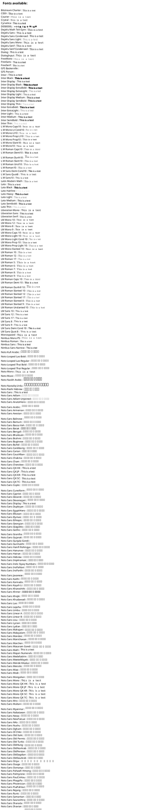

# Layout Options

C4-PlantUML comes with some layout options.

- [📄 C4-PlantUML](README.md#c4-plantuml)
- [📄 Layout Options](#layout-options)
  - [Layout Guidance and Practices](#layout-guidance-and-practices)
    - [Overall Guidance](#overall-guidance)
    - [Layout Practices](#layout-practices)
  - [LAYOUT_TOP_DOWN() or LAYOUT_LEFT_RIGHT() or LAYOUT_LANDSCAPE()](#layout_top_down-or-layout_left_right-or-layout_landscape)
  - [SHOW_ELEMENT_TYPE(?hideStereotype, ?hidePersonType)](#show_element_typehidestereotype-hidepersontype)
  - [LAYOUT_WITH_LEGEND() or SHOW_LEGEND(?hideStereotype, ?details)](#layout_with_legend-or-show_legendhidestereotype-details)
  - [SHOW_FLOATING_LEGEND(?alias, ?hideStereotype, ?details) and LEGEND()](#show_floating_legendalias-hidestereotype-details-and-legend)
  - [LAYOUT_AS_SKETCH() and SET_SKETCH_STYLE(?bgColor, ?fontColor, ?warningColor, ?fontName, ?footerWarning, ?footerText)](#layout_as_sketch-and-set_sketch_stylebgcolor-fontcolor-warningcolor-fontname-footerwarning-footertext)
  - [HIDE_STEREOTYPE()](#hide_stereotype)
  - [HIDE_PERSON_SPRITE(), SHOW_PERSON_SPRITE(?sprite), SHOW_PERSON_PORTRAIT() and SHOW_PERSON_OUTLINE()](#hide_person_sprite-show_person_spritesprite-show_person_portrait-and-show_person_outline)
    - [Using HIDE_PERSON_SPRITE()](#using-hide_person_sprite)
    - [Using SHOW_PERSON_SPRITE()](#using-show_person_sprite)
    - [Using SHOW_PERSON_SPRITE(sprite)](#using-show_person_spritesprite)
    - [Using SHOW_PERSON_PORTRAIT()](#using-show_person_portrait)
    - [Using SHOW_PERSON_OUTLINE()](#using-show_person_outline)
  - [(C4 styled) Sequence diagram specific layout options](#c4-styled-sequence-diagram-specific-layout-options)
    - [SHOW_ELEMENT_DESCRIPTIONS(?show)](#show_element_descriptionsshow)
    - [SHOW_FOOT_BOXES(?show)](#show_foot_boxesshow)
    - [SHOW_INDEX(?show)](#show_indexshow)
  - [Optional support of additional PlantUML elements](#optional-support-of-additional-plantuml-elements)
    - [List of supported PlantUML elements](#list-of-supported-plantuml-elements)
- [📄 Themes (different styles and languages)](Themes.md#themes)
- samples
  - [📄 C4 Model Diagrams](samples/C4CoreDiagrams.md#c4-model-diagrams)

## Layout Guidance and Practices

PlantUML uses [Graphviz](https://www.graphviz.org/) for its graph visualization. Thus the rendering itself is done automatically for you - that it one of the biggest advantages of using PlantUML.

...and also sometimes one of the biggest disadvantages, if the rendering is not what the user intended.

### Overall Guidance

1. Be minimal in the use of all directed relations - introduce the fewest possible directed `Rel_` and `Lay_` statements that achieve the desired layout. One way to do this is to immediately remove any of these you experiment with when they don't actually affect the layout at all. And of course you will remove the ones that affect it the layout in a negative way.
2. With dynamic rendering tools (e.g. VS Code plugin) do NOT trust the first rendering as it is shifty when adding code because you do not know exactly when it grabs the current unsaved code. Wait for a bit or close and reopen preview panel.

### Layout Practices

These are intended to correlate to the layout engine’s algorithm, but have (as of this writing) been determined by trial and error - not a code review.

Please read through all practices before starting.

1. Create all components, containers and boundaries first - in order top to bottom or left to right.
2. Use `Rel` (directionless) to create initial relationships.
3. If layout is not as desired, modify **some** Rel statements to contain direction `Rel_{direction}` to force shape layouts.
4. If the layout is not as desired, sparingly add `Lay_{direction}` to force any layouts that `Rel_{direction}` does not correct.
5. For both `Lay_{direction}` and `Rel_{direction}` statements used above:
   1. Exhaust attempts to get a working layout with `Rel_{direction}` before adding `Lay_{direction}`
   2. Try to introduce the fewest possible directed statements (of either type) that result in the desired layout.
   3. Immediately back out any directed statements that do not change the layout at all.
   4. Order inner objects first when it creates the desired result (enclosing objects tend to follow suit when child objects are ordered).
   5. When ordering multiple objects, only specify one relationship and, if possible in the same direction. For example if you want entity1 => entity2 => entity3, then `Rel_R(entity1,entity2)` and `Rel_R(entity2, entity3)` is the minimum possible statements and they all specify the same direction.
   6. Try NOT to apply directed statements to both inner elements and enclosing elements to force relationships that aren't working out.
   7. Make all orderings at the same nesting level whenever possible.
   8. Do NOT create duplicated, opposite direction statements in an attempt to force or ensure relationships as it does not affect the results. For instance if you have `Lay_R(entity1,entity2)` which is not working as desired and then also add the opposing one as `Lay_L(entity2,entity1)` - it does not help with forcing layouts to be as you want them. It might help to use `Lay_L` **instead of** `Lay_R`, but not both together.
6. Do not create an "All enclosing" boundary - the code for processing relationships seems to struggle with relationships inside this. Additionally, `SHOW_FLOATING_LEGEND()` will not display inside the All enclosing boundary.
7. Legend statements must come after at least one usage of each of the elements you want the legend to contain.

## LAYOUT_TOP_DOWN() or LAYOUT_LEFT_RIGHT() or LAYOUT_LANDSCAPE()

With the two macros `LAYOUT_TOP_DOWN()` and `LAYOUT_LEFT_RIGHT()` it is possible to easily change the flow visualization of the diagram. `LAYOUT_TOP_DOWN()` is the default.

```plantuml
@startuml LAYOUT_TOP_DOWN Sample
!include https://raw.githubusercontent.com/plantuml-stdlib/C4-PlantUML/v2.14.0/C4_Container.puml

/' Not needed because this is the default '/
LAYOUT_TOP_DOWN()

Person(admin, "Administrator")
System_Boundary(c1, 'Sample') {
    Container(web_app, "Web Application", "C#, ASP.NET Core 2.1 MVC", "Allows users to compare multiple Twitter timelines")
}
System(twitter, "Twitter")

Rel(admin, web_app, "Uses", "HTTPS")
Rel(web_app, twitter, "Gets tweets from", "HTTPS")
@enduml
```

`LAYOUT_LEFT_RIGHT()` rotates the flow visualization to _from Left to Right_ and directed relations like `Rel_Left()`, `Rel_Right()`, `Rel_Up()` and `Rel_Down()` are rotated too.

```plantuml
@startuml LAYOUT_LEFT_RIGHT Sample
!include https://raw.githubusercontent.com/plantuml-stdlib/C4-PlantUML/v2.14.0/C4_Container.puml

LAYOUT_LEFT_RIGHT()

Person(admin, "Administrator")
System_Boundary(c1, 'Sample') {
    Container(web_app, "Web Application", "C#, ASP.NET Core 2.1 MVC", "Allows users to compare multiple Twitter timelines")
}
System(twitter, "Twitter")

Rel(admin, web_app, "Uses", "HTTPS")
Rel(web_app, twitter, "Gets tweets from", "HTTPS")
@enduml
```

`LAYOUT_LANDSCAPE()` rotates the default flow visualization to _from Left to Right_ like `LAYOUT_LEFT_RIGHT()` additional **directed relations** like Rel_Left(), Rel_Right(), Rel_Up() and Rel_Down() **are not rotated** anymore.

```plantuml
@startuml LAYOUT_LANDSCAPE Sample
!include https://raw.githubusercontent.com/plantuml-stdlib/C4-PlantUML/v2.14.0/C4_Container.puml

LAYOUT_LANDSCAPE()

Person(admin, "Administrator")
System_Boundary(c1, 'Sample') {
    Container(web_app, "Web Application", "C#, ASP.NET Core 2.1 MVC", "Allows users to compare multiple Twitter timelines")
}
System(twitter, "Twitter")

Rel(admin, web_app, "Uses", "HTTPS")
Rel(web_app, twitter, "Gets tweets from", "HTTPS")

System(S,"S")
System(SU,"S Up")
System(SD,"S Down")
System(SL,"S Left")
System(SR,"S Right")

Rel_Up(S, SU, "Up")
Rel_Down(S, SD, "Down")
Rel_Left(S, SL, "Left")
Rel_Right(S, SR, "Right")

SHOW_LEGEND()

@enduml
```

[](https://www.plantuml.com/plantuml/uml/NP91RwCm48Nl_8hPxA54Ic6xwgcdiX2r1vgY65hj2JdWDfQCRTb3KLNjVzznGjEeN2o-D_FcZU7M8tSu3WhAxEzZKxTbjYbOdbLhO7omIaG_fExKs0lO8rf_awQEJychnFsu6xrmdT4eD2QT6LAhk0vUbnvx9NTfVdrP1TGybEdRx-JgElb5hCsfXKijN6AfE8g-JuwNKLG9vusEUJz8lO955axfqN4qRh6CsBj7CRH_pAXxxjxZxce55yV05qluY82UqvXu4hkMMqi-ps87cRLATXobqGj2-SyLPAnADkkQMfm02WeFJtdGCgNCv27iwG4Dq9AMKyamAfGq2-f98We7A0UXQ9QdRF_cT34UHVAPoqYCja9zRlKLg_7KIUTzNLUCgaBHIVsokHD8CIOHZXTdXlEMpw5ijM2d2ufPGw_Gs3DI15AOIP-nCh1IlE0PsmQsbQzxd6EtZILt84iAR8yfss1qe0NHsJNmO7RW9V7PEV23uK7Oad2oP_UFpssvlbjlYl3rRuNkwTVu3m==)

## SHOW_ELEMENT_TYPE(?hideStereotype, ?hidePersonType)

Instead of `<<stereotypes>>` is it also possible to show the element type in the technology section.
This can be enabled with `SHOW_ELEMENT_TYPE()`.

If you use the call `SHOW_LEGEND(false)` then the stereotypes remain visible (`$hideStereotype` default is `true`).  
If you use the call `SHOW_ELEMENT_TYPE($hidePersonType=false)` then all persons are displayed with element type too ´(`$hidePersonType` default is `true`).

```plantuml
@startuml SHOW_ELEMENT_TYPE Sample
!include https://raw.githubusercontent.com/plantuml-stdlib/C4-PlantUML/v2.14.0/C4_Container.puml

SHOW_ELEMENT_TYPE()

Person(admin, "Administrator")
System_Boundary(c1, 'Sample') {
    Container(web_app, "Web Application", "C#, ASP.NET Core 2.1 MVC", "Allows users to compare multiple Twitter timelines")
}
System(twitter, "Twitter")

Rel(admin, web_app, "Uses", "HTTPS")
Rel(web_app, twitter, "Gets tweets from", "HTTPS")
@enduml
```

## LAYOUT_WITH_LEGEND() or SHOW_LEGEND(?hideStereotype, ?details)

Colors can help to add additional information or simply to make the diagram more aesthetically pleasing.
It can also help to save some space.

All of that is the reason, C4-PlantUML uses colors and prefer also to enable a layout without `<<stereotypes>>` and with a legend.
This can be enabled with `LAYOUT_WITH_LEGEND()`.

```plantuml
@startuml LAYOUT_WITH_LEGEND Sample
!include https://raw.githubusercontent.com/plantuml-stdlib/C4-PlantUML/v2.14.0/C4_Container.puml

LAYOUT_WITH_LEGEND()

Person(admin, "Administrator")
System_Boundary(c1, 'Sample') {
    Container(web_app, "Web Application", "C#, ASP.NET Core 2.1 MVC", "Allows users to compare multiple Twitter timelines")
}
System(twitter, "Twitter")

Rel(admin, web_app, "Uses", "HTTPS")
Rel(web_app, twitter, "Gets tweets from", "HTTPS")
@enduml
```

Instead of a static legend (activated with `LAYOUT_WITH_LEGEND()`) a calculated legend can be activated with `SHOW_LEGEND(?hideStereotype, ?details)`.

The calculated legend has following differences:

- only relevant elements are listed
- custom tags/styles are supported
- stereotypes can remain visible (with `SHOW_LEGEND(false)`)
- details can be displayed in different sizes via the `$details` argument
  - `$details = Small()` .. default; details are displayed with a smaller size compared to the legend labels
  - `$details = Normal()` .. details and labels are displayed with same size
  - `$details = None()` .. only the labels are displayed
  - if `$legendText` contains `\n` then the text before is the label and the text behind the details
- **`SHOW_LEGEND()` has to be last call in the diagram**

```plantuml
@startuml SHOW_LEGEND Sample
!include https://raw.githubusercontent.com/plantuml-stdlib/C4-PlantUML/v2.14.0/C4_Container.puml

Person(admin, "Administrator")
System_Boundary(c1, 'Sample') {
    Container(web_app, "Web Application", "C#, ASP.NET Core 2.1 MVC", "Allows users to compare multiple Twitter timelines")
}
System(twitter, "Twitter")

Rel(admin, web_app, "Uses", "HTTPS")
Rel(web_app, twitter, "Gets tweets from", "HTTPS")

SHOW_LEGEND()
@enduml
```

Legend labels and details can be defined via `\n` in `$legendTest` arguments too.

```plantuml
@startuml
' convert it with additional command line argument -DRELATIVE_INCLUDE="./.." to use locally
!if %variable_exists("RELATIVE_INCLUDE")
  !include %get_variable_value("RELATIVE_INCLUDE")/C4_Container.puml
!else
  !include https://raw.githubusercontent.com/plantuml-stdlib/C4-PlantUML/v2.14.0/C4_Container.puml
!endif
' $legendText with \n defines the label and details of the legend entry ("backend container" is label, "eight sided shape" is details)
AddElementTag("backendContainer", $fontColor=$ELEMENT_FONT_COLOR, $bgColor="#335DA5", $shape=EightSidedShape(), $legendText="backend container\neight sided shape")
' $legendText without \n defines only a label
AddRelTag("async", $textColor=$ARROW_FONT_COLOR, $lineColor=$ARROW_COLOR, $lineStyle=DashedLine(), $legendText="async call")
' if no $legendText defined, $tag is automatically the label and all additional displayed properties are the details
AddRelTag("sync/async", $textColor=$ARROW_FONT_COLOR, $lineColor=$ARROW_COLOR, $lineStyle=DottedLine())

System_Boundary(c1, "Internet Banking") {
    Container(mobile_app, "Mobile App", "C#, Xamarin", "Provides a limited subset of the Internet banking functionality to customers via their mobile device")
    Container(backend_api, "API Application", "Java, Docker Container", "Provides Internet banking functionality via API", $tags="backendContainer")
}
System_Ext(banking_system, "Mainframe Banking System", "Stores all of the core banking information about customers, accounts, transactions, etc.")

Rel(mobile_app, backend_api, "Uses", "async, JSON/HTTPS", $tags="async")
Rel_Neighbor(backend_api, banking_system, "Uses", "sync/async, XML/HTTPS", $tags="sync/async")

SHOW_LEGEND()
@enduml
```

[![SHOW_LEGEND Sample, $legendText defines legend details - open link](https://www.plantuml.com/plantuml/svg/hLHDRziu4BtxLqpK5BK0Hzv-NHOmKDTMjoaSEx2TRWy5Z954oqGfKY0fDqAn_trd9DbnuXHxsOiWVipCUs_Uy8FpQ7rLgDuhI8tU2-j1UlWf_GumowINHgEYew90dO6IMW3Ql2g4zd0rNSQpyVhwQxovdazcTzDu54J3A0h06wYS06LILAhkNSWjlDoZbPWeiH7tqddN3vu61s4Fu4BgL5MPW9Uvy9jZp1vL9PuB6KxURIP6UoHaDYgPoOLGJfocsdbVkZ-7Gui_evoOLGc1iqJN4uk8k0rBXPfLk78-KpAXf5Utl7LtCnlktqIltqL_F5j8Pt9BobqgaTF_MjntqdtNa8ajtNJWTwG39a812vW9Ig0Sc6rxqCG1mR0rz8C4qn-yJWzr0f2kZHv086I-y-1a9Z9mEon5Szfb3A4tph9O2UxC6lDZiYFcO02NMrfCZ39sT1dFufjuljvyMj1difWjbdIUvErfyEBjs_VJyNkEQKgDOYw-ujehNlV3mIdhqJdqx_eSR_YCLgRoft8PhMh0JZ6cj1IgeOEkrYdZyHJPSHWlbuk_Z-3PdByzMFbQYT4KtKvaCrgV4MZo0_krWKcErUOHs1PXnWWmP-MnygP0BnkFF-apRPtEJoOTMQmc8KfhIXeoILJHYYQgw-0fMSOo_7yO6-yFZCDURrKxBuhDHrFf36tTJr-JiQvf4AmM7ZwY_Y5r7eJmY-O7uEYTVc4IIME8PKdtRve5ZCkIq0MJ5mFuXWLDgkRbhJLxQhdZ9if2Ucv-bJZAtdd-M2rfgy6sqccha_GrFnrfvKXPOHti9NACjD028AtsCXNDIt4AhtCVuPC4ONnxpU0KTORpCgelkCS1J0rTit0w4Wzu_mCNGw74GTj_DpgVhx3tpq7V-DxtkpGRrsonR7HjQx4G1vsXlSqeLjvOreniqycKqiOH2WKQMpHi01CUcQD60y0qfNPw-lCMjSC6DAs4JoC2rIDJFUhVOx7kd72Ce77R0Bwi5lFXv_NwTlN0j3LYo8asSvxgn3oH_8ph8Uk3aSaaz9W-oNpYSpRdPxBmBFuhda_xOUy3PQTNzby= "SHOW_LEGEND Sample, $legendText defines legend details")](https://www.plantuml.com/plantuml/uml/hLHDRziu4BtxLqpK5BK0Hzv-NHOmKDTMjoaSEx2TRWy5Z954oqGfKY0fDqAn_trd9DbnuXHxsOiWVipCUs_Uy8FpQ7rLgDuhI8tU2-j1UlWf_GumowINHgEYew90dO6IMW3Ql2g4zd0rNSQpyVhwQxovdazcTzDu54J3A0h06wYS06LILAhkNSWjlDoZbPWeiH7tqddN3vu61s4Fu4BgL5MPW9Uvy9jZp1vL9PuB6KxURIP6UoHaDYgPoOLGJfocsdbVkZ-7Gui_evoOLGc1iqJN4uk8k0rBXPfLk78-KpAXf5Utl7LtCnlktqIltqL_F5j8Pt9BobqgaTF_MjntqdtNa8ajtNJWTwG39a812vW9Ig0Sc6rxqCG1mR0rz8C4qn-yJWzr0f2kZHv086I-y-1a9Z9mEon5Szfb3A4tph9O2UxC6lDZiYFcO02NMrfCZ39sT1dFufjuljvyMj1difWjbdIUvErfyEBjs_VJyNkEQKgDOYw-ujehNlV3mIdhqJdqx_eSR_YCLgRoft8PhMh0JZ6cj1IgeOEkrYdZyHJPSHWlbuk_Z-3PdByzMFbQYT4KtKvaCrgV4MZo0_krWKcErUOHs1PXnWWmP-MnygP0BnkFF-apRPtEJoOTMQmc8KfhIXeoILJHYYQgw-0fMSOo_7yO6-yFZCDURrKxBuhDHrFf36tTJr-JiQvf4AmM7ZwY_Y5r7eJmY-O7uEYTVc4IIME8PKdtRve5ZCkIq0MJ5mFuXWLDgkRbhJLxQhdZ9if2Ucv-bJZAtdd-M2rfgy6sqccha_GrFnrfvKXPOHti9NACjD028AtsCXNDIt4AhtCVuPC4ONnxpU0KTORpCgelkCS1J0rTit0w4Wzu_mCNGw74GTj_DpgVhx3tpq7V-DxtkpGRrsonR7HjQx4G1vsXlSqeLjvOreniqycKqiOH2WKQMpHi01CUcQD60y0qfNPw-lCMjSC6DAs4JoC2rIDJFUhVOx7kd72Ce77R0Bwi5lFXv_NwTlN0j3LYo8asSvxgn3oH_8ph8Uk3aSaaz9W-oNpYSpRdPxBmBFuhda_xOUy3PQTNzby=)

Legend details can be deactivated via `SHOW_LEGEND($details=None())`

```plantuml
@startuml
' convert it with additional command line argument -DRELATIVE_INCLUDE="./.." to use locally
!if %variable_exists("RELATIVE_INCLUDE")
  !include %get_variable_value("RELATIVE_INCLUDE")/C4_Container.puml
!else
  !include https://raw.githubusercontent.com/plantuml-stdlib/C4-PlantUML/v2.14.0/C4_Container.puml
!endif
' $legendText with \n defines the label and details of the legend entry ("backend container" is label, "eight sided shape" is details)
AddElementTag("backendContainer", $fontColor=$ELEMENT_FONT_COLOR, $bgColor="#335DA5", $shape=EightSidedShape(), $legendText="backend container\neight sided shape")
' $legendText without \n defines only a label
AddRelTag("async", $textColor=$ARROW_FONT_COLOR, $lineColor=$ARROW_COLOR, $lineStyle=DashedLine(), $legendText="async call")
' if no $legendText defined, $tag is automatically the label and all additional displayed properties are the details
AddRelTag("sync/async", $textColor=$ARROW_FONT_COLOR, $lineColor=$ARROW_COLOR, $lineStyle=DottedLine())

System_Boundary(c1, "Internet Banking") {
    Container(mobile_app, "Mobile App", "C#, Xamarin", "Provides a limited subset of the Internet banking functionality to customers via their mobile device")
    Container(backend_api, "API Application", "Java, Docker Container", "Provides Internet banking functionality via API", $tags="backendContainer")
}
System_Ext(banking_system, "Mainframe Banking System", "Stores all of the core banking information about customers, accounts, transactions, etc.")

Rel(mobile_app, backend_api, "Uses", "async, JSON/HTTPS", $tags="async")
Rel_Neighbor(backend_api, banking_system, "Uses", "sync/async, XML/HTTPS", $tags="sync/async")

SHOW_LEGEND($details=None())
@enduml
```

[![SHOW_LEGEND Sample, hide details with $details=None() - open link](https://www.plantuml.com/plantuml/svg/hLHDRzf04BtpAoPkge94J3ylbP1AmMrJ4OY0j3rKGcDxCQkkTwtTDOrLzRztnZQ4X5Izz69vFsRclJTlzftpQ7sPgyupI8pU2Uj1UlWf_HOmJQMNHgEYepn7dOAIMW3QhCo5zd0nMKJJqUhoIxI-d8sdDvDe68I3C0p06oYT06KILAhgdCaDFDsXbHWhiHQtqddN3Hu61xqEm9dKYIfJ0KypuTU7c1sgKZmMCXY_Ne-DzaZ8R5WmapEXd3XEjVM-S6y70ui_muoObJ61iqJN4ukGk0qAXPfLk70-LJAcf1VNl7LpDHtiNeOlNeVF7osaKxaXvSwLoEX_9MvRwRvhICM6RZhmMz81Ow601Km59L0EpAOvgEE0ODWAka6CoGzU9_iw0KZNHFSX43BRUd0o5IcuBHQYFcqpzg0pIjD82UxC2hD3iWFce0_d6rgCZJ9sU1vDewjejbf_cDDdF9_E5tGUPyrfyEJLgpUJqHkEgKiD8ow-vDfBNdTx_MFMmrFet_KftjuZMfdI7yjbjAe0MyMOqaAecWwwIYUCnrDaos6qMCo_7i2pEVzwiFIL4iC9kgr8fxG-8L3d1_Ph3PCSgyqzi0t2b15WnifZwKsENjOUVz1dsZgUdrGwibX5GXJM53HaagYY5NLKsy5Zienby7yO6-_tZ7kTph9oNkJhzwRKATggcxmWOrtI85WjFBn7_KFgBEZ1BveVW8Dtkhc99OqX5WNTlweNC2eAGXUCd_JX6-OqgPgNrzRigEMEcoXpwRdvPUmeU-lvGxMugGQRKYUDJj9N_7GafIDbXNMmayWnqa83WBJQoKJKByKnlDPzX4yIXD7r9ODJr1dEowW-umxxC35qpSBnIDpX_GSkXaA9WwR_RdWwNxtExxs-qQtljcdMhjvYsUZQnc8kzZf3SvjHBBsnh1dPffKfeOq350eqDg_P0COyCWUD-e19GktqzESjQeSrQ5e9duG4gaEckjU_-sBTEE4OGUssFdnUpcU3JwlLzVAEQMF47YTQptYgO_D0yXEk-wntHYQJq6Fw8FEHpzcSdyZ2q-XZD9jqpzkf6CvCOzrtL8mUtJy= "SHOW_LEGEND Sample, hide details with $details=None()")](https://www.plantuml.com/plantuml/uml/hLHDRzf04BtpAoPkge94J3ylbP1AmMrJ4OY0j3rKGcDxCQkkTwtTDOrLzRztnZQ4X5Izz69vFsRclJTlzftpQ7sPgyupI8pU2Uj1UlWf_HOmJQMNHgEYepn7dOAIMW3QhCo5zd0nMKJJqUhoIxI-d8sdDvDe68I3C0p06oYT06KILAhgdCaDFDsXbHWhiHQtqddN3Hu61xqEm9dKYIfJ0KypuTU7c1sgKZmMCXY_Ne-DzaZ8R5WmapEXd3XEjVM-S6y70ui_muoObJ61iqJN4ukGk0qAXPfLk70-LJAcf1VNl7LpDHtiNeOlNeVF7osaKxaXvSwLoEX_9MvRwRvhICM6RZhmMz81Ow601Km59L0EpAOvgEE0ODWAka6CoGzU9_iw0KZNHFSX43BRUd0o5IcuBHQYFcqpzg0pIjD82UxC2hD3iWFce0_d6rgCZJ9sU1vDewjejbf_cDDdF9_E5tGUPyrfyEJLgpUJqHkEgKiD8ow-vDfBNdTx_MFMmrFet_KftjuZMfdI7yjbjAe0MyMOqaAecWwwIYUCnrDaos6qMCo_7i2pEVzwiFIL4iC9kgr8fxG-8L3d1_Ph3PCSgyqzi0t2b15WnifZwKsENjOUVz1dsZgUdrGwibX5GXJM53HaagYY5NLKsy5Zienby7yO6-_tZ7kTph9oNkJhzwRKATggcxmWOrtI85WjFBn7_KFgBEZ1BveVW8Dtkhc99OqX5WNTlweNC2eAGXUCd_JX6-OqgPgNrzRigEMEcoXpwRdvPUmeU-lvGxMugGQRKYUDJj9N_7GafIDbXNMmayWnqa83WBJQoKJKByKnlDPzX4yIXD7r9ODJr1dEowW-umxxC35qpSBnIDpX_GSkXaA9WwR_RdWwNxtExxs-qQtljcdMhjvYsUZQnc8kzZf3SvjHBBsnh1dPffKfeOq350eqDg_P0COyCWUD-e19GktqzESjQeSrQ5e9duG4gaEckjU_-sBTEE4OGUssFdnUpcU3JwlLzVAEQMF47YTQptYgO_D0yXEk-wntHYQJq6Fw8FEHpzcSdyZ2q-XZD9jqpzkf6CvCOzrtL8mUtJy=)

## SHOW_FLOATING_LEGEND(?alias, ?hideStereotype, ?details) and LEGEND()

`LAYOUT_WITH_LEGEND()` and SHOW_LEGEND(?hideStereotype)` adds the legend at the bottom right of the picture like below and additional whitespace is created.

```plantuml
@startuml Layout With Whitespace Sample
!include https://raw.githubusercontent.com/plantuml-stdlib/C4-PlantUML/v2.14.0/C4_Container.puml

Person(a, "Person A")
Container(b, "Container B", "techn")
System(c, "System C")
Container(d, "Container D", "techn")
Container_Ext(e, "Ext. Container E", "techn")

Rel_R(a, b, "calls")
Rel_D(b, c, "uses")
Rel_D(c, d, "uses")
Rel_R(d, e, "updates")

SHOW_LEGEND()
@enduml
```

Therefore a floating legend can be added via SHOW_FLOATING_LEGEND(), positioned with Lay_Distance() and existing whitespace is reused like below.

- `SHOW_FLOATING_LEGEND(?alias, ?hideStereotype): shows the legend in the drawing area
- `LEGEND()`: is the default alias of the created floating legend and can be used in Lay_Distance() call

```plantuml
@startuml Compact Legend Layout Sample
!include https://raw.githubusercontent.com/plantuml-stdlib/C4-PlantUML/v2.14.0/C4_Container.puml

Person(a, "Person A")
Container(b, "Container B", "techn")
System(c, "System C")
Container(d, "Container D", "techn")
Container_Ext(e, "Ext. Container E", "techn")

Rel_R(a, b, "calls")
Rel_D(b, c, "uses")
Rel_D(c, d, "uses")
Rel_R(d, e, "updates")

SHOW_FLOATING_LEGEND()
Lay_Distance(LEGEND(), e, 1)
@enduml
```

## LAYOUT_AS_SKETCH() and SET_SKETCH_STYLE(?bgColor, ?fontColor, ?warningColor, ?fontName, ?footerWarning, ?footerText)

C4-PlantUML can be especially helpful during up-front design sessions.
One thing which is often ignored is the fact, that these software architecture sketches are just sketches.

Without any proof

- if they are technically possible
- if they can fulfill all requirements
- if they keep what they promise

More often these sketches are used by many people as facts and are manifested into their documentations.
With `LAYOUT_AS_SKETCH()` you can make a difference.

```plantuml
@startuml LAYOUT_AS_SKETCH Sample
!include https://raw.githubusercontent.com/plantuml-stdlib/C4-PlantUML/v2.14.0/C4_Container.puml

LAYOUT_AS_SKETCH()

Person(admin, "Administrator")
System_Boundary(c1, 'Sample') {
    Container(web_app, "Web Application", "C#, ASP.NET Core 2.1 MVC", "Allows users to compare multiple Twitter timelines")
}
System(twitter, "Twitter")

Rel(admin, web_app, "Uses", "HTTPS")
Rel(web_app, twitter, "Gets tweets from", "HTTPS")
@enduml
```

Additional styles and the footer text can be changed with SET_SKETCH_STYLE():

- `SET_SKETCH_STYLE(?bgColor, ?fontColor, ?warningColor, ?fontName, ?footerWarning, ?footerText)`:
  Enables the modification of different sketch styles and footer.

The possible font name(s) depend on the output format (e.g. PNG uses fonts which are installed on the server and SVG fonts have to be installed on the client).
Additional is it possible to define comma separated fall back fonts (if the diagrams are exported as SVG. Atm
PNG does not support fallback fonts based on a PlantUML [bug](https://forum.plantuml.net/14842/specify-fall-back-fonts-is-not-working), but this could be fixed in one of the following versions)

```plantuml
@startuml LAYOUT_AS_SKETCH Sample
!include https://raw.githubusercontent.com/plantuml-stdlib/C4-PlantUML/v2.14.0/C4_Container.puml

SET_SKETCH_STYLE($bgColor="lightblue", $fontColor="darkblue", $warningColor="darkred", $footerWarning="Sketch", $footerText="Created for discussion")

' PNG with font jlm_cmmi10 (typically another font is used)
' SET_SKETCH_STYLE($fontName="jlm_cmmi10")

' SVG with fallback fonts MS Gothic,Comic Sans MS, Comic Sans, Chalkboard SE, Comic Neue, cursive, sans-serif (typically without "MS Gothic")
SET_SKETCH_STYLE($fontName="MS Gothic,Comic Sans MS,Comic Sans,Chalkboard SE,Comic Neue,cursive,sans-serif")

LAYOUT_AS_SKETCH()

Person(admin, "Administrator")
System_Boundary(c1, 'Sample') {
    Container(web_app, "Web Application", "C#, ASP.NET Core 2.1 MVC", "Allows users to compare multiple Twitter timelines")
}
System(twitter, "Twitter")

Rel(admin, web_app, "Uses", "HTTPS")
Rel(web_app, twitter, "Gets tweets from", "HTTPS")
@enduml
```

PNG with font `jlm_cmmi10`

[](https://www.plantuml.com/plantuml/uml/VLFRQjj047ttLqpLG1HGxAJagM28Aum3JLpJLHBo95RIsDvwBs9t5DU4_djduskXhLvMcZbdpfcTqMqWwQapklT1sLft3SAIg0sV1mClr_s5ecLNTG5zxIoXfNxjpA3LqaREPQ16gsgGtrpEOkZnuNxm-gb_VTE_ubYPCqKgYxxVHe6U61Ub-3ekyhjI52_tu_IiMkHEEpzCj5eigT8T9XcSpPctY-z3Q-cjidjq8_tAOxF5EaB_l4qF4x52gfV7H84_QPZa7YLX0tFdeL6Xxa9GpYONlTuvpAOJM7EN45NXXpPbROowleAKDgsgfTORaDRH4lqMeWBmVJGNVsadvgVIu30vrjcgYAUz2XUiPBrwhnNWGS24QwiwovrHDGXfOp23uoU_BwLULKxw1iHudvfYXndKdG_gbLy28ozvJ6f-QZnAkeuWEUYm7NRp7-V_SdHYw4y_9tRsRevcOlVtevTlZqKv4ZlDb6CpzC7PL3P6sGoIKJnL82_9UUQ8JI0qvHVNMPxr9gslCpWNqhGQpo_WhGVy7BOhNMDLohRbEizOmQXjDRTFSS8SoZzcC1Ap_dHSCCKZy7x2mrCUSoEjtVfzd3u0EU3TRYL3JAT9iHOKV86yHK3Ae6QjmDv-xTobj4rodHqiDliTzRwhewt7m4m-xufY9XWLGOViiSm4UIDeZV6OUsTEARTe6_w9VWC=)

SVG with fallback fonts MS Gothic,Comic Sans MS,Comic Sans,Chalkboard SE,Comic Neue,cursive,sans-serif

[](https://www.plantuml.com/plantuml/uml/VLDTRzf047pdLspTI36I0qcLfqf8eHOYKWb5jPCeJzRPNk3AVLXtwr0KzRztBs2Wgbg_dBqxipDxkxxp91orMlK-I5EfjaPO4pN-yt3en7QmahHkozQZgwmXD3Ieh1usIfZ0kV9KAraEqzkhHGWzFio6hvy6DxU3QuuLALE4DEW6JH3ePPEyoBvEylI-oFANsII-A5UfLTQD8YLNQofLYr425qlc7U9TQ2kSaQP3ry9j7DPxh2Lqp_lqACesIDNwbCZn9usYrA4Wh65f7TJILwttqfget-jTmc8-XIrt2K4LVYXTL5hBcsk8QTV8IYYr0s4ihT7j8T83tqVTP-xV3GN4N6WSHQTAUvtigTFXagMeDk_LF3naCENgiafIgsK5cJ0XcC3faz_NGcrAArpDcbrgZYqcKBNEorT-yOoyua79vRdr86bRWkYemtR-v_jVVixi_Edcp4pdvMGbz3uRltnxp8jnTj2CERP0vws9HQsbII0QXrDwSeAi2mPtdb0NNsnhUDQxkBf9u38Jkb5usOUt7l1ptAvuYsKXceRhF6C9uwPHt3o52NCe_PZ0E5iCvfESAGw1znCUdjAG6ojbj-_ZT1x80kzs8nYYMqMIjI3dw-Cj0f8Q5MjvzlRhu2wcVPBh762XsU-ekgvEjXuzC_cyp_D5ngW0EcPFPQR8-q1R3CVIMNrEkKDJyq_q6m==)

All available (PNG) fonts can be displayed with

```plantuml
@startuml
listfonts
@enduml
```

## HIDE_STEREOTYPE()

To enable a layout without `<<stereotypes>>` and legend.
This can be enabled with `HIDE_STEREOTYPE()`.

```plantuml
@startuml HIDE_STEREOTYPE Sample
!include https://raw.githubusercontent.com/plantuml-stdlib/C4-PlantUML/v2.14.0/C4_Container.puml

HIDE_STEREOTYPE()

Person(admin, "Administrator")
System_Boundary(c1, 'Sample') {
    Container(web_app, "Web Application", "C#, ASP.NET Core 2.1 MVC", "Allows users to compare multiple Twitter timelines")
}
System(twitter, "Twitter")

Rel(admin, web_app, "Uses", "HTTPS")
Rel(web_app, twitter, "Gets tweets from", "HTTPS")
@enduml
```

## HIDE_PERSON_SPRITE(), SHOW_PERSON_SPRITE(?sprite), SHOW_PERSON_PORTRAIT() and SHOW_PERSON_OUTLINE()

With the macros `HIDE_PERSON_SPRITE()`, `SHOW_PERSON_SPRITE()` and `SHOW_PERSON_PORTRAIT()` it is possible to change the person related default sprite or person layout itself. `SHOW_PERSON_SPRITE()` is the default.

- **HIDE_PERSON_SPRITE()**: deactivates the default sprite
- **SHOW_PERSON_SPRITE()**: activates the default sprite "person"
- **SHOW_PERSON_SPRITE($sprite)**: activates a specific sprite as default sprite
- **SHOW_PERSON_PORTRAIT()**: activates portrait instead of a rectangle
- **SHOW_PERSON_OUTLINE()**: activates person outline instead of a rectangle

"person" and "person2" are predefined sprites which can be used as default sprite too.

```plantuml
@startuml predefined sprites Sample
!include https://raw.githubusercontent.com/plantuml-stdlib/C4-PlantUML/v2.14.0/C4_Container.puml

Person(userA, "User A", "with predefined sprite person", "person")
Person(userB, "User B", "with predefined sprite person2", "person2")
@enduml
```

### Using HIDE_PERSON_SPRITE()

```plantuml
@startuml HIDE_PERSON_SPRITE Sample
!include https://raw.githubusercontent.com/plantuml-stdlib/C4-PlantUML/v2.14.0/C4_Container.puml

HIDE_PERSON_SPRITE()

Person(admin, "Administrator")
System_Boundary(c1, 'Sample') {
    Container(web_app, "Web Application", "C#, ASP.NET Core 2.1 MVC", "Allows users to compare multiple Twitter timelines")
}
System(twitter, "Twitter")

Rel(admin, web_app, "Uses", "HTTPS")
Rel(web_app, twitter, "Gets tweets from", "HTTPS")
@enduml
```

### Using SHOW_PERSON_SPRITE()

```plantuml
@startuml SHOW_PERSON_SPRITE Sample
!include https://raw.githubusercontent.com/plantuml-stdlib/C4-PlantUML/v2.14.0/C4_Container.puml

/' Not needed because this is the default with sprite "person" '/
SHOW_PERSON_SPRITE()

Person(admin, "Administrator")
System_Boundary(c1, 'Sample') {
    Container(web_app, "Web Application", "C#, ASP.NET Core 2.1 MVC", "Allows users to compare multiple Twitter timelines")
}
System(twitter, "Twitter")

Rel(admin, web_app, "Uses", "HTTPS")
Rel(web_app, twitter, "Gets tweets from", "HTTPS")
@enduml
```

### Using SHOW_PERSON_SPRITE(sprite)

```plantuml
@startuml SHOW_PERSON_SPRITE(sprite) Sample
!include https://raw.githubusercontent.com/plantuml-stdlib/C4-PlantUML/v2.14.0/C4_Container.puml
!define osaPuml https://raw.githubusercontent.com/Crashedmind/PlantUML-opensecurityarchitecture2-icons/master
!include osaPuml/Common.puml
!include osaPuml/User/all.puml

SHOW_PERSON_SPRITE("osa_user_green_architect")

Person(admin, "Administrator")
System_Boundary(c1, 'Sample') {
    Container(web_app, "Web Application", "C#, ASP.NET Core 2.1 MVC", "Allows users to compare multiple Twitter timelines")
}
System(twitter, "Twitter")

Rel(admin, web_app, "Uses", "HTTPS")
Rel(web_app, twitter, "Gets tweets from", "HTTPS")
@enduml
```

[ Sample")](https://www.plantuml.com/plantuml/uml/ZL3BJiCm4BpdAqmv4AGs1jGJ9qfK0HAqKPF2CNAJBRNab-mDKONuTzRqXJZXoyexipkpSnTGUEoqIiwaQLJN0jiWkd3BkHTzzYvnqwsw0Bwn1i5WrbZDdH8cpem2jagkU3uU5R6rV7dc7pVPzJYxebwTquYG1dpcVWHQMDEFsI0A-lz39_SYRA3LqhJy832o3ao0flCIjy8t6udGOEVXPYHfDd0j0e8_dRENuxdLsfgzbR_WafIvK6e79-NZ_AqkfejoFglBOl5KJTC1KUjei7xt0AO-IWykawG07wn9HRGwP8D9h3AW5sWzuUMMBEdwtdQc5NwRDjT3Tb4AxHHSNBBFXD4xXfNsiAg5SxJd3LPiufoIZK1fpO1Q-VcGJSeYcqqh6l70A6xsyff7RAAKxGEB9WD3ooX29uYYEuMIj5ZLIwHi64eDYhG2UVlQkqjn1zAUFIqUjW1rkEfaYy8AKU-ngegIM95qH4zh7W39HW-nhBtLlqVkmBIKz3S=)

### Using SHOW_PERSON_PORTRAIT()

```plantuml
@startuml SHOW_PERSON_PORTRAIT() Sample
!include https://raw.githubusercontent.com/plantuml-stdlib/C4-PlantUML/v2.14.0/C4_Container.puml

SHOW_PERSON_PORTRAIT()

Person(admin, "Administrator")
System_Boundary(c1, 'Sample') {
    Container(web_app, "Web Application", "C#, ASP.NET Core 2.1 MVC", "Allows users to compare multiple Twitter timelines")
}
System(twitter, "Twitter")

' if a person is combined with a sprite then the rectangle layout is used again
Person(person, "Person with sprite", $sprite="person2")

Rel(admin, web_app, "Uses", "HTTPS")
Rel(web_app, twitter, "Gets tweets from", "HTTPS")
@enduml
```

[ Sample")](https://www.plantuml.com/plantuml/uml/RL5BIyD04BxdLunLQ0erKV4a28r5L50RccYFOPECxS9cTzcT68hutvqrlWxcaDtCVFCz9WjFmb7VAIXkLviglruNgySgNwtBTNPNnZCeH6SLHWTIDwfl4NP4rb-agHD3ifMqw-lUeskC9jIKDAPBhH8wC1vxQfMiq-NvSHvAJm_twUjPSdgUd72jMlA8a1fTOXaSHV_hHr6EpXiTYxQJUWwJB9pIanDat6GM5NjFs5LNfjUjSFkuEPt3T3GzdS5R1FpyICK3rfMmbdasM4DchPAD86dqX4lBmpbaHPuyNfSyuX3OB3myBqClKyeC7a9M3sI0Wrh1aAvN95aBoa4IeGEI7IhMykpj_SjTJ6EJURvWt8oc85z0WFtC1z87pfedMs3CZZlUEaa8j4CTNk2m8Q6tBAR4tlGKPjXG2sBBwRuNDVAnrFWzaerK7EHel5rEHjXPCB96zRtUt_qyUOx0vsrPvWMZ0kYd-vld1edtCM0uNfpf_euiKBVyQpy0)

### Using SHOW_PERSON_OUTLINE()

> This call requires PlantUML version >= v1.2021.4!

```plantuml
@startuml SHOW_PERSON_OUTLINE() Sample
!include https://raw.githubusercontent.com/plantuml-stdlib/C4-PlantUML/v2.14.0/C4_Container.puml

SHOW_PERSON_OUTLINE()

Person(admin, "Administrator")
System_Boundary(c1, 'Sample') {
    Container(web_app, "Web Application", "C#, ASP.NET Core 2.1 MVC", "Allows users to compare multiple Twitter timelines")
}
System(twitter, "Twitter")

' if a person is combined with a sprite then the rectangle layout is used again
Person(person, "Person with sprite", $sprite="person2")

Rel(admin, web_app, "Uses", "HTTPS")
Rel(web_app, twitter, "Gets tweets from", "HTTPS")
@enduml
```

[ Sample")](https://www.plantuml.com/plantuml/uml/RL5BIyD04BxdLunLQ0erKUb94AobgA1jCAaUmoOPsuNDxh8xCHJnlpjhwkDW3jdDp3VVOtBjIJZgMWNvtVgbp9PF-NfLhZV5m_rg6KyW5wrL61r9NQkkGTWHMN-PfaxqoLRIhgiwZwuscb1JKfisjKheG7ZggL6oIXUpqooKDeyFwTj5SZvBphXMBdX4I8qkiGoEed_beoX3vusEHTDAFONHF9pIanDat6WIvNjFs9OtfjEDSFkuFf_2UF0ydi1x1FpyACKzLgMmbdbUi8AvjKhMWgJH8oujZgSmpxDajInun26mLtXyNeJUN2dJUmXHFP01pca5GzfEaMGjA7f9X0v8jgXOoxEtZuExc8OcynnWt8p685z1WFtA1z87peed6s3CZZlUEaa8j4CTNk2m9g6tBAR4tdGKPjXG0sBBwRuNDV2nrF0za0rK7EHak5sD1jX5CFA4wdkzl_lPU8x0vrrHP3cZ0kYd-vld5edtqMCuNfrf_uvSesx2d_q4)

## (C4 styled) Sequence diagram specific layout options

- **SHOW_ELEMENT_DESCRIPTIONS(?show)**: show or hide (hidden is default) all element/participant related descriptions
- **SHOW_FOOT_BOXES(?show)**: show or hide (hidden is default) all element/participant related foot boxes
- **SHOW_INDEX(?show)**: show or hide (hidden is default) the relationship (call) related index (sequence number)

show is defined with `$show=true` and hide is defined with `$show=false`

### SHOW_ELEMENT_DESCRIPTIONS(?show)

```plantuml
@startuml
!include https://raw.githubusercontent.com/plantuml-stdlib/C4-PlantUML/v2.14.0/C4_Sequence.puml

SHOW_ELEMENT_DESCRIPTIONS()

Person(admin, "Administrator", "People that administrates the products")
System_Boundary(c1, 'Sample')
    Container(web_app, "Web Application", "C#, ASP.NET Core 2.1 MVC", "Allows users to compare multiple Twitter timelines")
' in a sequence diagram Boundary_End() has to be used instead of  { }
Boundary_End()
System(twitter, "Twitter")

Rel(admin, web_app, "Uses", "HTTPS")
Rel(web_app, twitter, "Gets tweets from", "HTTPS")
@enduml
```

[ Sample")](https://www.plantuml.com/plantuml/uml/LL5BJzj04BxxLqp38OuKx59nwedKjG2910iRE5fhxq1MsbTtnxLGrV_UMGYax6MacVbUinUHHA39wEoBigEU9CAUoCVlPHd4N3mhsa_3536CpX9QAaPdIg-5JPZJI5AheQpEJvlKkj_UbB-_5MVdnLVkzIt-cj2EMFZ4dxLNjuzzVLDlwrtN_wpRwkwwwQvlTss-oh86GtGs5z8ekuR59bKLAGXoOS6D1ftN2BGN1E8unCWj11-Sd4QAYrNMlaH2q_zmavKYlEJZsHgMhJ2CNguou5Tn4g4iXdp6eHVUC_qZ3h3nNgjHa78sALOdQzYqJR6hEuO410u6suSgpJPQkpb2kWiRSC17yO9NpAH99P_Th8Wm02c3chMIioKe2mBYuIeWbNWEmi2xrRwsCb_1NhnI3fZe9MCuZv3WdW3-mD_iy_OXRavlUcpjeCnwsHtgzuCUazv7DiFrgkkQbhVIqiVqI7E9n3PcJEKfEFC_v0Ajv1_z1m==)

### SHOW_FOOT_BOXES(?show)

```plantuml
@startuml
!include https://raw.githubusercontent.com/plantuml-stdlib/C4-PlantUML/v2.14.0/C4_Sequence.puml

SHOW_FOOT_BOXES()

Person(admin, "Administrator")
System_Boundary(c1, 'Sample')
    Container(web_app, "Web Application", "C#, ASP.NET Core 2.1 MVC", "Allows users to compare multiple Twitter timelines")
' in a sequence diagram Boundary_End() has to be used instead of  { }
Boundary_End()
System(twitter, "Twitter")

Rel(admin, web_app, "Uses", "HTTPS")
Rel(web_app, twitter, "Gets tweets from", "HTTPS")
@enduml
```

[ Sample")](https://www.plantuml.com/plantuml/uml/LL79JiCm4BtdAuPoQ2gr2I1Ed6Yh0WUW5GdBBNBYWLhoXZqXGeX_PmnbysMayLljqqWYK6zqjgTiftk9i2NoyQGiWnYA9qNRlkqZXivPGaj5vqpfjR29CuiajMhBvV5iarQtLvVbor5nU5mSyAwfyBb7ss7XatvMNQplcxFrkcuMwuTLbK-oR8CXEfiBQPITmcYUfeeK1BamccJLQoGqpSBrLehmcdU7KnXNmdYDuqa6V9QSIYYB8H-mROJth7AFBSozrweJf9mTyMgvFuLvjIckLpLJ0WA7XAkxPRgRQ-s62AbZ17B01RrWYEarANQ2Ub14682KGSrUaPEDGLaG47SDGIhn58I1xwZDoify0blnATbYafVCuJv2Wdi4U8Ftx3zwLpUdBp-EjdDcl-m6zVSp_JQzZHo6vqLTRof69T3FxQ_CEHB7632Dn-3CNyefMic_ym4=)

### SHOW_INDEX(?show)

```plantuml
@startuml
!include https://raw.githubusercontent.com/plantuml-stdlib/C4-PlantUML/v2.14.0/C4_Sequence.puml

SHOW_INDEX()

Person(admin, "Administrator")
System_Boundary(c1, 'Sample')
    Container(web_app, "Web Application", "C#, ASP.NET Core 2.1 MVC", "Allows users to compare multiple Twitter timelines")
' in a sequence diagram Boundary_End() has to be used instead of  { }
Boundary_End()
System(twitter, "Twitter")

Rel(admin, web_app, "Uses", "HTTPS")
Rel(web_app, twitter, "Gets tweets from", "HTTPS")
@enduml
```

[ Sample")](https://www.plantuml.com/plantuml/uml/LL79JiCm4BtdAuPoQ2gL110dJfHIKIGA5IdBBNBYWLhoXZqXGeX_Pmmj1Lz66h_LFeia0dL6PtlAjhgJ26iY7q_BCeY-U56qxfekOcYT9RHKjCwKNWkRE0UHf5PDEJqvMARL_UAwV3ikZawAGzxL5RvsQ5iiVDBFgldjOtrrSp5xoaTPjiGGdSs5DCgEOJ19KqKAWbmOZBBgFHAQ-jnrLehmdhT7OnXMmdYDmr46VAOSI2YB8U-ngONthFA83KoyrweLf9mTy6gwFuP9jInkPYkc10JE1uk7QRgRQEtw2AbU17B0tRnWYEaqANQ2LQ-8C00fWvgz8YSRWh8W86xAWLJY9GW3swZrpCfy16lnBTbWafVCuJv2Wdi6-83Fx3zwKpUd7p-Ejd5cl-mEzVQPTatl8uVXEL-jbXMZ4kZtTYTpYSGnUapZEJZpbtA6LlB7V04=)

## Optional support of additional PlantUML elements

More often a full support of all PlantUML elements are requested.  
They can be set via the new optional `baseShape="...."` argument of the calls

- `System(..., ?baseShape)`,
- `System_Ext(..., ?baseShape)`,
- `Container(..., ?baseShape)`,
- `Container_Ext(..., ?baseShape)`,
- `Component(..., ?baseShape)`,
- `Component_Ext(..., ?baseShape)`

The already specified `...Db...()` and `...Queue...()` calls are not extended.

But based on the additional (internal) overhead it has to be explicit enabled
via `ENABLE_ALL_PLANT_ELEMENTS`. It can be set with following 2 options

- `!ENABLE_ALL_PLANT_ELEMENTS = 1` directly in the scripts file
  BEFORE the first C4\_\* file is loaded, like e.g.

```plantuml
@startuml
!ENABLE_ALL_PLANT_ELEMENTS = 1
!include https://raw.githubusercontent.com/plantuml-stdlib/C4-PlantUML/v2.14.0/C4_Component.puml
...
@enduml
```

- or via additional command line parameter `-DENABLE_ALL_PLANT_ELEMENTS=1`

If `ENABLE_ALL_PLANT_ELEMENTS` is not set, the diagrams displays the requested "PlantUML element"
but the style is not correct displayed.

**A simple sample with additional "PlantUML elements":**

```plantuml
@startuml
!ENABLE_ALL_PLANT_ELEMENTS = 1
!include https://raw.githubusercontent.com/plantuml-stdlib/C4-PlantUML/v2.14.0/C4_Component.puml

Component(comp, "Copy component")

Component(config, "Config component", $baseShape="package")

ComponentDb(dbA, "DB A")
' alternative syntax for ComponentDb() with $baseShape="database"
Component(dbB, "DB B", $baseShape="database")

Rel_U(comp, config, "Configured by")
Rel_L(comp, dbA, "Reads from")
Rel_R(comp, dbB, "Writes to")

SHOW_LEGEND()
@enduml
```

### List of supported PlantUML elements

| PlantUML element | Support  | Comment                                                                                                               |
| ---------------- | -------- | --------------------------------------------------------------------------------------------------------------------- |
| rectangle        | &#x2705; | already supported (works even without ENABLE_ALL_PLANT_ELEMENTS)                                                      |
| database         | &#x2705; | already supported (works even without ENABLE_ALL_PLANT_ELEMENTS)                                                      |
| queue            | &#x2705; | already supported (works even without ENABLE_ALL_PLANT_ELEMENTS)                                                      |
| node             | &#x274C; | **should not be used**, already defined for Node() (works even without ENABLE_ALL_PLANT_ELEMENTS)                     |
| person           | &#x274C; | **should not be used**, already defined for Person() (works even without ENABLE_ALL_PLANT_ELEMENTS)                   |
|                  |          |                                                                                                                       |
| actor            | &#x2611; | requires ENABLE_ALL_PLANT_ELEMENTS                                                                                    |
| agent            | &#x2611; | requires ENABLE_ALL_PLANT_ELEMENTS                                                                                    |
| artifact         | &#x2611; | requires ENABLE_ALL_PLANT_ELEMENTS                                                                                    |
| boundary         | &#x2611; | requires ENABLE_ALL_PLANT_ELEMENTS                                                                                    |
| card             | &#x2611; | requires ENABLE_ALL_PLANT_ELEMENTS                                                                                    |
| circle           | &#x2611; | requires ENABLE_ALL_PLANT_ELEMENTS                                                                                    |
| cloud            | &#x2611; | requires ENABLE_ALL_PLANT_ELEMENTS                                                                                    |
| collections      | &#x2611; | requires ENABLE_ALL_PLANT_ELEMENTS                                                                                    |
| control          | &#x2611; | requires ENABLE_ALL_PLANT_ELEMENTS                                                                                    |
| entity           | &#x2611; | requires ENABLE_ALL_PLANT_ELEMENTS                                                                                    |
| file             | &#x2611; | requires ENABLE_ALL_PLANT_ELEMENTS                                                                                    |
| folder           | &#x2611; | requires ENABLE_ALL_PLANT_ELEMENTS                                                                                    |
| frame            | &#x2611; | requires ENABLE_ALL_PLANT_ELEMENTS                                                                                    |
| hexagon          | &#x2611; | requires ENABLE_ALL_PLANT_ELEMENTS                                                                                    |
| interface        | &#x2611; | requires ENABLE_ALL_PLANT_ELEMENTS                                                                                    |
| label            | &#x2611; | requires ENABLE_ALL_PLANT_ELEMENTS                                                                                    |
| package          | &#x2611; | requires ENABLE_ALL_PLANT_ELEMENTS                                                                                    |
| stack            | &#x2611; | requires ENABLE_ALL_PLANT_ELEMENTS                                                                                    |
| storage          | &#x2611; | requires ENABLE_ALL_PLANT_ELEMENTS                                                                                    |
| usecase          | &#x2611; | requires ENABLE_ALL_PLANT_ELEMENTS                                                                                    |
| usecase/         | &#x2611; | requires ENABLE_ALL_PLANT_ELEMENTS                                                                                    |
|                  |          |                                                                                                                       |
| actor/           | &#x274C; | requires ENABLE_ALL_PLANT_ELEMENTS, not working (font color not changed to $bkColor) - and/or conflict with existing? |

If `ENABLE_ALL_PLANT_ELEMENTS` is not set, the diagrams displays the requested "PlantUML element"
but the style is not correct.
