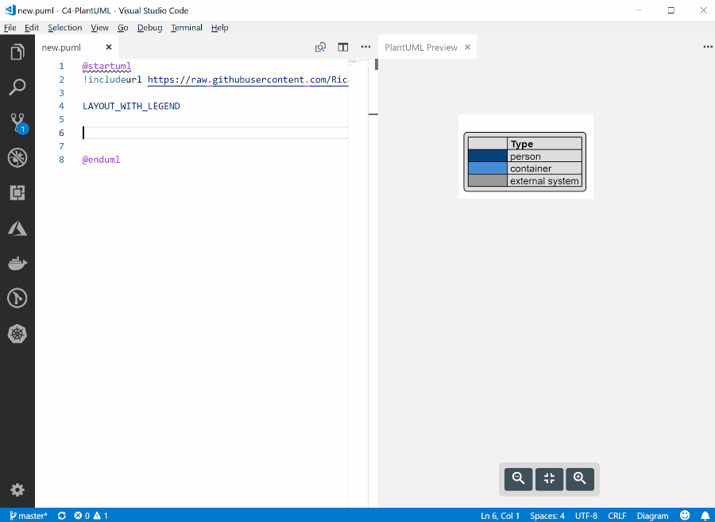
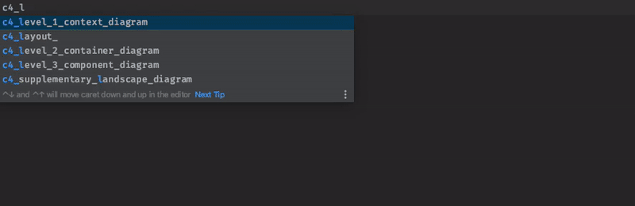
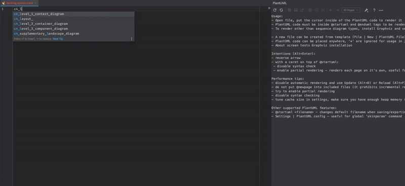

[![release][Release Badge]][Release Page]
[![license MIT][License Badge]][License Page]
 &nbsp; &nbsp; &nbsp;
[![commits since][Commits Since Badge]][Commit Page]
[![last commit][Last Commit Badge]][Commit Page]
[![build result][Tests Badge]][Tests Page]

[Release Badge]: https://img.shields.io/github/v/release/plantuml-stdlib/C4-PlantUML?display_name=tag
[Release Page]: https://github.com/plantuml-stdlib/C4-PlantUML/releases/latest
[License Badge]: https://img.shields.io/github/license/plantuml-stdlib/C4-PlantUML
[License Page]: https://github.com/plantuml-stdlib/C4-PlantUML/blob/master/LICENSE

[Commits Since Badge]: https://img.shields.io/github/commits-since/plantuml-stdlib/C4-PlantUML/latest?label=new%20unreleased%20changes
[Last Commit Badge]: https://img.shields.io/github/last-commit/plantuml-stdlib/C4-PlantUML?color=yellow
[Commit Page]: https://github.com/plantuml-stdlib/C4-PlantUML/commits
[Tests Badge]: https://github.com/plantuml-stdlib/C4-PlantUML/actions/workflows/run-percy-tests.yml/badge.svg
[Tests Page]: https://github.com/plantuml-stdlib/C4-PlantUML/actions/workflows/run-percy-tests.yml

# C4-PlantUML

[comment]: # ("image is based on percy/C4_Container Diagram Sample - bigbankplc-styles.puml")
[![Container diagram for Internet Banking System](https://www.plantuml.com/plantuml/png/hLRVZzf647xdhvYGH0690rLfNYgT50xSvYAuey0bVKDZxs1MMU-wksiuLFL_xwmnDYOdvI5zkMDdThxls_anyD5vjBx8LEST94RloNgG7WxIxm25a5uQZOfTMOPQW9AQ06rQPAGzt4oNqMoyllyIRUuV9hEdQNJR7Ow6movu0uKZK2P1fOwTLt8BR_Te9SQADlGidNUzxdLmjzy1U2LreWf1y3OblwbZzgWAUYbaDFbrCp7Q8okpmpoyv1KfHvTGE-zpzzjePF4mJFbbHSpYRC9HfFsGtpRA5UgGXHldXP8nWzuiWkbfFXjbw3pP5tcqaDjEP_NfyUjc4IrNZm-RnwVrxFuXwlKvdsjC7RWYputre0su71Do83Nu7O76ZA0NeoC1vcGgj23BAPOwXS19nXzpSWCux6Io0s7qEry3LcYeZvcnr1y2CzvlQxCbiFHtGOmZpfIAKfOygFw3f-UgqcKGxD25miK4WhPIa-YCXOWKXLhpMthT69Dl75YdeJk0Dri-J8mozlPDD8lcqSDwy_iZ_vaypXwNx8_JaxVx-ltx3zFnXn3ZTfZJRIJJdLz9GM8Lphq-UqxArYpizim6oPaEUXH2m8MOVhSVv2r9bTBG7NKIiFbHPptZvP8Bqr8J-lVIstAi_57HxHJTZiHCQbRKeWWCe_-HntZVy7Iyz8gWJYq8YQd53BR6mhtsP3Lvk4FzBJJ7wkWyPPtEWgmpkfSKpfkCx00czQVk6CvcCDko_3573qu5pyj0LAKDC4bCeRthieuJzEQE3GBjiPVymbZN0hfz-AS308tUte7Y3UOvN_vACOppNCa4m_Reikapxd40gzm6yVClas2Raf9xbb5ASvxl9b2D9A0MfRdcZSyFNunPP9lPvSXmAtOhkbbWIe7zpBfAhCpz0COwBHJQO5vOivSYp8XIBxDi2vsS5f_qH_2cpgI3lSGG8otmWo6svk38VYSfCx5KLELZ7WwrgCdh0Vo56N8gsc90oKo6ONL5xCXpqNv2t4a02DhBXAxbJUEUG8zXzOGwL1-3cjMVCsYTlR7a86nBi9HAvsrPKv2Q-p8hFmzWLquCOE5ta5WIfBr4vGQXhyWvK2Rb0_ba-5sYgXddJCdGielxbpjdQlYQRU9QcVj1Xa9I6BYSMKpTxNTRZ4NzM_TzzEnxbA5K6rSQc2YwcVEvchd0lDuHo98K5SnbOeqpMm_HSx93dHAS8Xds0hFIrg0ofjvQpEXgg2_IZagTko1XG_s-Y-G3ngRmJGiCwbaUWBUe7PQPQDBVMPAws1VDr3uvSe7xqtgzMF75zZsNum_lL4tVm5LqcuUmjcFJx8WIhja05L9fR3L4JLXktG5yvc_OKKdULBDqLGYDWfy3sjnnS2Ex6POsw99GEDXQavKBws2b9mVU1AAAPtetOSWQyo9RLqssObW7T1Ei9KOZvAeVsnhQSONZ_cZeL_FrWe5QDMY5NtLbawVckuwtrNnsdQl6pV2dtp-pw8_eOThhTxR6UB8WB1xqwSlc_4iAzaDu6mekZUxrovmrlxE2buzVpkxEHrPPPEe_ "Container diagram for Internet Banking System")](https://www.plantuml.com/plantuml/uml/hLRVZzf647xdhvYGH0690rLfNYgT50xSvYAuey0bVKDZxs1MMU-wksiuLFL_xwmnDYOdvI5zkMDdThxls_anyD5vjBx8LEST94RloNgG7WxIxm25a5uQZOfTMOPQW9AQ06rQPAGzt4oNqMoyllyIRUuV9hEdQNJR7Ow6movu0uKZK2P1fOwTLt8BR_Te9SQADlGidNUzxdLmjzy1U2LreWf1y3OblwbZzgWAUYbaDFbrCp7Q8okpmpoyv1KfHvTGE-zpzzjePF4mJFbbHSpYRC9HfFsGtpRA5UgGXHldXP8nWzuiWkbfFXjbw3pP5tcqaDjEP_NfyUjc4IrNZm-RnwVrxFuXwlKvdsjC7RWYputre0su71Do83Nu7O76ZA0NeoC1vcGgj23BAPOwXS19nXzpSWCux6Io0s7qEry3LcYeZvcnr1y2CzvlQxCbiFHtGOmZpfIAKfOygFw3f-UgqcKGxD25miK4WhPIa-YCXOWKXLhpMthT69Dl75YdeJk0Dri-J8mozlPDD8lcqSDwy_iZ_vaypXwNx8_JaxVx-ltx3zFnXn3ZTfZJRIJJdLz9GM8Lphq-UqxArYpizim6oPaEUXH2m8MOVhSVv2r9bTBG7NKIiFbHPptZvP8Bqr8J-lVIstAi_57HxHJTZiHCQbRKeWWCe_-HntZVy7Iyz8gWJYq8YQd53BR6mhtsP3Lvk4FzBJJ7wkWyPPtEWgmpkfSKpfkCx00czQVk6CvcCDko_3573qu5pyj0LAKDC4bCeRthieuJzEQE3GBjiPVymbZN0hfz-AS308tUte7Y3UOvN_vACOppNCa4m_Reikapxd40gzm6yVClas2Raf9xbb5ASvxl9b2D9A0MfRdcZSyFNunPP9lPvSXmAtOhkbbWIe7zpBfAhCpz0COwBHJQO5vOivSYp8XIBxDi2vsS5f_qH_2cpgI3lSGG8otmWo6svk38VYSfCx5KLELZ7WwrgCdh0Vo56N8gsc90oKo6ONL5xCXpqNv2t4a02DhBXAxbJUEUG8zXzOGwL1-3cjMVCsYTlR7a86nBi9HAvsrPKv2Q-p8hFmzWLquCOE5ta5WIfBr4vGQXhyWvK2Rb0_ba-5sYgXddJCdGielxbpjdQlYQRU9QcVj1Xa9I6BYSMKpTxNTRZ4NzM_TzzEnxbA5K6rSQc2YwcVEvchd0lDuHo98K5SnbOeqpMm_HSx93dHAS8Xds0hFIrg0ofjvQpEXgg2_IZagTko1XG_s-Y-G3ngRmJGiCwbaUWBUe7PQPQDBVMPAws1VDr3uvSe7xqtgzMF75zZsNum_lL4tVm5LqcuUmjcFJx8WIhja05L9fR3L4JLXktG5yvc_OKKdULBDqLGYDWfy3sjnnS2Ex6POsw99GEDXQavKBws2b9mVU1AAAPtetOSWQyo9RLqssObW7T1Ei9KOZvAeVsnhQSONZ_cZeL_FrWe5QDMY5NtLbawVckuwtrNnsdQl6pV2dtp-pw8_eOThhTxR6UB8WB1xqwSlc_4iAzaDu6mekZUxrovmrlxE2buzVpkxEHrPPPEe_)

C4-PlantUML combines the benefits of [PlantUML](https://plantuml.com/) and the [C4 model](https://c4model.com/) for providing a simple way of describing and communicating software architectures – especially during up-front design sessions – with an intuitive language using open source and platform independent tools.

C4-PlantUML includes macros, stereotypes, and other goodies (like VSCode Snippets) for creating C4 diagrams with PlantUML.

- [📄 C4-PlantUML](#c4-plantuml)
  - [Getting Started](#getting-started)
    - [Including the C4-PlantUML library](#including-the-c4-plantuml-library)
    - [Now let's create a C4 Container diagram](#now-lets-create-a-c4-container-diagram)
  - [Supported Diagram Types](#supported-diagram-types)
    - [System Context & System Landscape diagrams](#system-context--system-landscape-diagrams)
    - [Container diagram](#container-diagram)
    - [Component diagram](#component-diagram)
    - [Dynamic diagram](#dynamic-diagram)
    - [Deployment diagram](#deployment-diagram)
    - [(C4 styled) Sequence diagram](#c4-styled-sequence-diagram)
    - [Samples](#samples)
  - [Relationship Types](#relationship-types)
  - [Layout (arrange) elements (without relationships)](#layout-arrange-elements-without-relationships)
  - [Global Layout Options](#global-layout-options)
  - [Sprites and other images](#sprites-and-other-images)
  - [Custom tags/stereotypes support and skinparam updates](#custom-tagsstereotypes-support-and-skinparam-updates)
    - [Element specific tag definitions](#element-specific-tag-definitions)
    - [Boundary specific tag definitions](#boundary-specific-tag-definitions)
    - [Comments](#comments)
    - [Sample with different tag combinations](#sample-with-different-tag-combinations)
    - [Sample with tag dependent sprites and custom legend text](#sample-with-tag-dependent-sprites-and-custom-legend-text)
    - [Sample with different boundary tag combinations](#sample-with-different-boundary-tag-combinations)
    - [Custom schema definitions (via UpdateElementStyle())](#custom-schema-definitions-via-updateelementstyle)
  - [Element and Relationship properties](#element-and-relationship-properties)
  - [Version information](#version-information)
  - [Snippets for Visual Studio Code](#snippets-for-visual-studio-code)
  - [Live Templates for IntelliJ](#live-templates-for-intellij)
    - [Prerequisites](#prerequisites)
    - [Install](#install)
    - [Usage](#usage)
  - [Advanced Samples](#advanced-samples)
    - [techtribes.js](#techtribesjs)
    - [Message Bus and Microservices](#message-bus-and-microservices)
  - [Background](#background)
  - [License](#license)
- [📄 Layout Options](LayoutOptions.md#layout-options)
- [📄 Themes (different styles and languages)](Themes.md#themes)
- samples
  - [📄 C4 Model Diagrams](samples/C4CoreDiagrams.md#c4-model-diagrams)

## Getting Started

### Including the C4-PlantUML library

At the top of your C4 PlantUML `.puml` file, you need to include the `C4_Context.puml`, `C4_Container.puml` or `C4_Component.puml` file found in the `root` of this repo.

To be independent of any Internet connectivity, you can download the files found in the `root` and make use of them by supplying the command line argument `-DRELATIVE_INCLUDE="."` to PlantUML:

```bash
java -jar plantuml.jar -DRELATIVE_INCLUDE="."  ...
```

> For Visual Studio Code, add the following to your settings.json:
>
> ```json
> "plantuml.jarArgs": [
>   "-DRELATIVE_INCLUDE=."
> ]
> ```

If you want to use the always up-to-date version of the C4-PlantUML library in this repo (which obviously requires an Internet connection every time you render a document), use the following:

[comment]: # ("!include followed with 2 spaces that it is not replaced during release based branch updates")
```plantuml
!include  https://raw.githubusercontent.com/plantuml-stdlib/C4-PlantUML/master/C4_Container.puml
```

If you don't need the up-to-date version, PlantUML includes the last released `C4_...` files as [standard library C4](https://plantuml.com/stdlib#062f75176513a666) \(no additional files or Internet is required). You can use it with following:

```plantuml
!include <C4/C4_Container>
```

### Now let's create a C4 Container diagram

\(If you don't want run PlantUML locally you can use e.g. the [PlantUML Web Server](https://www.plantuml.com/plantuml/uml/ZOvFIyGm4CNl-HIrfowupSMJfvNrk6BnprccwT069fEGcI3zzhO5YoAAf_VcmVlDEub2rXB8N7bsL0Qi9jKajzPcU6z7hrFfYs1saHLPMnU3JGIyTewY0_dUdc-EtHgzFbni057CI_HsNXhW6NERLhxfC4la9croHnxakgelq2FLYtbCwYC3LVSeBlljgWzcXpJkq_selg2RE58Svpz0pxCeXaOs-UztyuJqVV3lAtR4bpa7Sq8UIg0F) too.)

After you have included `C4_Container.puml` you can use the defined macro definitions for the C4 elements: `Person`, `Person_Ext`, `System`, `System_Ext`, `Container`, `Relationship`, `Boundary`, and `System_Boundary`

```plantuml
@startuml C4_Elements
!include https://raw.githubusercontent.com/plantuml-stdlib/C4-PlantUML/master/C4_Container.puml

Person(personAlias, "Label", "Optional Description")
Container(containerAlias, "Label", "Technology", "Optional Description")
System(systemAlias, "Label", "Optional Description")

Rel(personAlias, containerAlias, "Label", "Optional Technology")
@enduml
```


In addition to this, it is also possible to define a system or component boundary.

Take a look at the following sample of a C4 Container Diagram:

```plantuml
@startuml Basic Sample
!include https://raw.githubusercontent.com/plantuml-stdlib/C4-PlantUML/master/C4_Container.puml

Person(admin, "Administrator")
System_Boundary(c1, "Sample System") {
    Container(web_app, "Web Application", "C#, ASP.NET Core 2.1 MVC", "Allows users to compare multiple Twitter timelines")
}
System(twitter, "Twitter")

Rel(admin, web_app, "Uses", "HTTPS")
Rel(web_app, twitter, "Gets tweets from", "HTTPS")
@enduml
```


Entities can also be decorated with icons/sprites using the $sprite parameter, for example:

```plantuml
@startuml
!include https://raw.githubusercontent.com/plantuml-stdlib/C4-PlantUML/master/C4_Container.puml

!define DEVICONS https://raw.githubusercontent.com/tupadr3/plantuml-icon-font-sprites/master/devicons
!define FONTAWESOME https://raw.githubusercontent.com/tupadr3/plantuml-icon-font-sprites/master/font-awesome-5
!include DEVICONS/angular.puml
!include DEVICONS/java.puml
!include DEVICONS/msql_server.puml
!include FONTAWESOME/users.puml

LAYOUT_WITH_LEGEND()

Person(user, "Customer", "People that need products", $sprite="users")
Container(spa, "SPA", "angular", "The main interface that the customer interacts with", $sprite="angular")
Container(api, "API", "java", "Handles all business logic", $sprite="java")
ContainerDb(db, "Database", "Microsoft SQL", "Holds product, order and invoice information", $sprite="msql_server")

Rel(user, spa, "Uses", "https")
Rel(spa, api, "Uses", "https")
Rel_R(api, db, "Reads/Writes")
@enduml
```


Similar to icons/sprites is it possible to add links to all elements and relationships:

```plantuml
@startuml Basic Sample
!include https://raw.githubusercontent.com/plantuml-stdlib/C4-PlantUML/master/C4_Container.puml

Person(admin, "Administrator", $sprite="person2", $link="https://github.com/plantuml-stdlib/C4-PlantUML/blob/master/LayoutOptions.md#hide_person_sprite-or-show_person_spritesprite")
System_Boundary(c1, "Sample System", $link="https://github.com/plantuml-stdlib/C4-PlantUML") {
    Container(web_app, "Web Application", "C#, ASP.NET Core 2.1 MVC", $descr="Allows users to compare multiple Twitter timelines", $link="https://github.com/plantuml-stdlib/C4-PlantUML/blob/master/LayoutOptions.md")
}
System(twitter, "Twitter", $link="https://github.com/plantuml-stdlib/C4-PlantUML")

Rel(admin, web_app, "Uses", "HTTPS", $link="https://plantuml.com/link")
Rel(web_app, twitter, "Gets tweets from", "HTTPS", $link="https://plantuml.com/link")
@enduml
```

> `png` itself supports no links, therefore the following image is generated as `svg` image.
> Github does not support `svg` links in README.md.
> If you click on the image a new window is opened and there you can use the links.


Elements and relationships can be decorated with tags and explained via a calculated legend, for example:

```plantuml
@startuml
!include https://raw.githubusercontent.com/plantuml-stdlib/C4-PlantUML/master/C4_Container.puml

AddElementTag("v1.0", $borderColor="#d73027")
AddElementTag("v1.1", $fontColor="#d73027")
AddElementTag("backup", $fontColor="orange")

AddRelTag("backup", $textColor="orange", $lineColor="orange", $lineStyle = DashedLine())

Person(user, "Customer", "People that need products")
Person(admin, "Administrator", "People that administrates the products via the new v1.1 components", $tags="v1.1")
Container(spa, "SPA", "angular", "The main interface that the customer interacts with via v1.0", $tags="v1.0")
Container(spaAdmin, "Admin SPA", "angular", "The administrator interface that the customer interacts with via new v1.1", $tags="v1.1")
Container(api, "API", "java", "Handles all business logic (incl. new v1.1 extensions)", $tags="v1.0+v1.1")
ContainerDb(db, "Database", "Microsoft SQL", "Holds product, order and invoice information")
Container(archive, "Archive", "Audit logging", "Stores 5 years", $tags="backup")

Rel(user, spa, "Uses", "https")
Rel(spa, api, "Uses", "https")
Rel_R(api, db, "Reads/Writes")
Rel(admin, spaAdmin, "Uses", "https")
Rel(spaAdmin, api, "Uses", "https")
Rel_L(api, archive, "Writes", "messages", $tags="backup")

SHOW_LEGEND()
@enduml
```


## Supported Diagram Types

> - `arg`: argument required (e.g. `alias`)
> - `?arg`: argument optional (e.g. `?tags`); an optional argument can be directly set via its keyword `$arg=...` (e.g. `$tags="specificTag"`) without the other optional arguments

### System Context & System Landscape diagrams

  - Import: `!include https://raw.githubusercontent.com/plantuml-stdlib/C4-PlantUML/master/C4_Context.puml`
  - Macros:
    - `Person(alias, label, ?descr, ?sprite, ?tags, ?link, ?type)`
    - `Person_Ext(alias, label, ?descr, ?sprite, ?tags, ?link, ?type)`
    - `System(alias, label, ?descr, ?sprite, ?tags, ?link, ?type, ?baseShape)`
    - `SystemDb(alias, label, ?descr, ?sprite, ?tags, ?link, ?type)`
    - `SystemQueue(alias, label, ?descr, ?sprite, ?tags, ?link, ?type)`
    - `System_Ext(alias, label, ?descr, ?sprite, ?tags, ?link, ?type, ?baseShape)`
    - `SystemDb_Ext(alias, label, ?descr, ?sprite, ?tags, ?link, ?type)`
    - `SystemQueue_Ext(alias, label, ?descr, ?sprite, ?tags, ?link, ?type)`
    - `Boundary(alias, label, ?type, ?tags, ?link, ?descr)`
    - `Enterprise_Boundary(alias, label, ?tags, ?link, ?descr)`
    - `System_Boundary(alias, label, ?tags, ?link, ?descr)`
  - Sprites:
    - `person`
    - `person2`
    - `robot`
    - `robot2`

  - C4 Model extension: Person() and System() support `$type` argument too. Is uses the same notation as `$techn`, e.g. `$type="characteristic A"` is displayed as `[characteristic A]`

### Container diagram

  - Import: `!include https://raw.githubusercontent.com/plantuml-stdlib/C4-PlantUML/master/C4_Container.puml`
  - Additional Macros  (based on context diagram macros):
    - `Container(alias, label, ?techn, ?descr, ?sprite, ?tags, ?link, ?baseShape)`
    - `ContainerDb(alias, label, ?techn, ?descr, ?sprite, ?tags, ?link)`
    - `ContainerQueue(alias, label, ?techn, ?descr, ?sprite, ?tags, ?link)`
    - `Container_Ext(alias, label, ?techn, ?descr, ?sprite, ?tags, ?link, ?baseShape)`
    - `ContainerDb_Ext(alias, label, ?techn, ?descr, ?sprite, ?tags, ?link)`
    - `ContainerQueue_Ext(alias, label, ?techn, ?descr, ?sprite, ?tags, ?link)`
    - `Container_Boundary(alias, label, ?tags, ?link, ?descr)`

### Component diagram

  - Import: `!include https://raw.githubusercontent.com/plantuml-stdlib/C4-PlantUML/master/C4_Component.puml`
  - Additional Macros (based on container diagram macros):
    - `Component(alias, label, ?techn, ?descr, ?sprite, ?tags, ?link, ?baseShape)`
    - `ComponentDb(alias, label, ?techn, ?descr, ?sprite, ?tags, ?link)`
    - `ComponentQueue(alias, label, ?techn, ?descr, ?sprite, ?tags, ?link)`
    - `Component_Ext(alias, label, ?techn, ?descr, ?sprite, ?tags, ?link, ?baseShape)`
    - `ComponentDb_Ext(alias, label, ?techn, ?descr, ?sprite, ?tags, ?link)`
    - `ComponentQueue_Ext(alias, label, ?techn, ?descr, ?sprite, ?tags, ?link)`

### Dynamic diagram

  - Import: `!include https://raw.githubusercontent.com/plantuml-stdlib/C4-PlantUML/master/C4_Dynamic.puml`
  - Additional Macros (based on component diagram macros):
    - (lowercase) `increment($offset=1)`: increase current index (procedure which has no direct output)
    - (lowercase) `setIndex($new_index)`: set the new index (procedure which has no direct output)
    - `LastIndex()`: return the last used index (function which can be used as argument)

    following 2 macros requires V1.2020.24Beta4 (can be already tested with <https://www.plantuml.com/plantuml/>)
    - `Index($offset=1)`: returns current index and calculates next index (function which can be used as argument)
    - `SetIndex($new_index)`: returns new set index and calculates next index (function which can be used as argument)

  -  All relationship macros are extended with `?index= `:

     > All `RelIndex...()` calls are obsolete and can be replaced with calls like Rel($index=..., ...) or Rel(..., $index=).
     > A full sample see [samples/C4_Dynamic Diagram Sample - message bus.puml](samples/C4_Dynamic%20Diagram%20Sample%20-%20message%20bus.puml)

### Deployment diagram

  - Import: `!include https://raw.githubusercontent.com/plantuml-stdlib/C4-PlantUML/master/C4_Deployment.puml`
  - Additional Macros (based on **container** diagram macros):
    - `Deployment_Node(alias, label, ?type, ?descr, ?sprite, ?tags, ?link)`
    - `Node(alias, label, ?type, ?descr, ?sprite, ?tags, ?link)`: short name of Deployment_Node()
    - `Node_L(alias, label, ?type, ?descr, ?sprite, ?tags, ?link)`: left aligned Node()
    - `Node_R(alias, label, ?type, ?descr, ?sprite, ?tags, ?link)`: right aligned Node()

### (C4 styled) Sequence diagram

C4-PlantUML **does not offer** a full sequence diagram support,
but existing elements and relationships can be reused as participants and calls in the corresponding styles.

> **!!! Contrary to all other diagrams, please define boundaries without `{` and `}` and mark a boundary end with `Boundary_End()` !!!**

  - Import: `!include https://raw.githubusercontent.com/plantuml-stdlib/C4-PlantUML/master/C4_Sequence.puml`
  - Macros (based on **component** diagram macros):
    - Basically all element specific macros (Person, System, Container...) can be reused with following differences:
      - element descriptions are typically not displayed (can be activated via SHOW_ELEMENT_DESCRIPTIONS())
      - **boundaries have to be defined without `{` and `}`** and instead of `}` the **`Boundary_End()`** macro has to be called
    - Additional (element specific) Macros:
      - `Boundary_End()`
    - Additional Layout Options:
      - `SHOW_ELEMENT_DESCRIPTIONS(?show)`
      - `SHOW_FOOT_BOXES(?show)`
      - `SHOW_INDEX(?show)`
    - Only following (extended) relationship specific macros is supported:
      - `Rel($from, $to, $label, $techn="", $descr="", $sprite="", $tags="", $link="", $index="", $rel="")`  
        `$index` enables the definition of active/next index with e.g. the related index macros below  
        `$rel` enables the definition of all PlantUML specific arrow types, details see e.g.
        [All arrow types](https://plantuml.com/sequence-diagram#4764f83f72ed032f) and
        [Slanted or odd arrows](https://plantuml.com/sequence-diagram#5bd6712206960fab)
    - The index related macros (like the dynamic diagram)
      - `Index($offset=1)`: returns current index and calculates next index (function which can be used as argument)
      - `SetIndex($new_index)`: returns new set index and calculates next index (function which can be used as argument)
      - `LastIndex()`: return the last used index (function which can be used as argument)
      - (lowercase) `increment($offset=1)`: increase current index (procedure which has no direct output)
      - (lowercase) `setIndex($new_index)`: set the new index (procedure which has no direct output)

  - (Typically additional used) PlantUML statements:
    - [Grouping message](https://plantuml.com/sequence-diagram#425ba4350c02142c)
    - [Divider or separator](https://plantuml.com/sequence-diagram#d4b2df53a72661cc)
    - [Reference](https://plantuml.com/sequence-diagram#63d5049791d9d79d)
    - [Delay](https://plantuml.com/sequence-diagram#8f497c1a3d15af9e)

### Samples

Take a look at each of the [C4 Model Diagram Samples](samples/C4CoreDiagrams.md).

## Relationship Types

- `Rel(from, to, label, ?techn, ?descr, ?sprite, ?tags, ?link)`
- `BiRel` (bidirectional relationship)

You can force the direction of a relationship by using:

- `Rel_U`, `Rel_Up`
- `Rel_D`, `Rel_Down`
- `Rel_L`, `Rel_Left`
- `Rel_R`, `Rel_Right`

In following sample a person uses different systems, and a group of persons which have bidirectional relationships

```plantuml
@startuml
!include https://raw.githubusercontent.com/plantuml-stdlib/C4-PlantUML/master/C4_Container.puml
HIDE_STEREOTYPE()

Person(a, "A")
Person(b, "B")
Person(c, "C")
Person(d, "D")
Person(e, "E")

BiRel_U(a, b, "talk with")
BiRel_R(a, c, "talk with")
BiRel_D(a, d, "talk with")
BiRel_L(a, e, "talk with")

Person(x, "X")
System(s1, "S1")
System(s2, "S2")
System(s3, "S3")
System(s4, "S4")

Rel_U(x, s1, "uses")
Rel_R(x, s2, "uses")
Rel_D(x, s3, "uses")
Rel_L(x, s4, "uses")
@enduml
```

 relationship versus bidirectional relationship")

## Layout (arrange) elements (without relationships)

In rare cases, you can force the layout of elements which have no relationships by using:

- `Lay_U(from, to)`, `Lay_Up(from, to)`
- `Lay_D(from, to)`, `Lay_Down(from, to)`
- `Lay_L(from, to)`, `Lay_Left(from, to)`
- `Lay_R(from, to)`, `Lay_Right(from, to)`

In following sample a person uses different systems, and a group of persons which have no relationships

```plantuml
@startuml
!include https://raw.githubusercontent.com/plantuml-stdlib/C4-PlantUML/master/C4_Container.puml
HIDE_STEREOTYPE()

Person(a, "A")
Person(b, "B")
Person(c, "C")
Person(d, "D")
Person(e, "E")

Lay_U(a, b)
Lay_R(a, c)
Lay_D(a, d)
Lay_L(a, e)

Person(x, "X")
System(s1, "S1")
System(s2, "S2")
System(s3, "S3")
System(s4, "S4")

Rel_U(x, s1, "uses")
Rel_R(x, s2, "uses")
Rel_D(x, s3, "uses")
Rel_L(x, s4, "uses")
@enduml
```


(In combination with [SHOW_FLOATING_LEGEND()](LayoutOptions.md#show_floating_legendalias-hidestereotype-details-and-legend)) a greater distance between an element and the
e.g. floating legend could be required that all e.g. corners of the drawing area can be reached.

- `Lay_Distance(from, to, ?distance)`: Sets the distance between `from` and `to` with down alignment (Lay_Distance(from,to,0) equals Lay_D(from, to)). The default alias of the floating legend is LEGEND().

In following sample the floating legend should be in the left bottom corner of the drawing are.
(The normal SHOW_LEGEND() call requires no extra Lay_Distance() call and the legend is automatically drawn below the diagram on the right side)

```plantuml
@startuml
!include https://raw.githubusercontent.com/plantuml-stdlib/C4-PlantUML/master/C4_Container.puml

!define DEVICONS https://raw.githubusercontent.com/tupadr3/plantuml-icon-font-sprites/master/devicons
!define FONTAWESOME https://raw.githubusercontent.com/tupadr3/plantuml-icon-font-sprites/master/font-awesome-5
!include DEVICONS/angular.puml
!include DEVICONS/java.puml
!include DEVICONS/msql_server.puml
!include FONTAWESOME/users.puml

Person(user, "Customer", "People that need products", $sprite="users")
Container(spa, "SPA", "angular", "The main interface that the customer interacts with", $sprite="angular")
Container(api, "API", "java", "Handles all business logic", $sprite="java")
ContainerDb(db, "Database", "Microsoft SQL", "Holds product, order and invoice information", $sprite="msql_server")

Rel(user, spa, "Uses")
Rel(spa, api, "Uses")
Rel_R(api, db, "Reads/Writes")

SHOW_FLOATING_LEGEND()
Lay_Distance(LEGEND(), db, 1)
@enduml
```


## Global Layout Options

C4-PlantUML also comes with some layout options to make it easy and reusable to create nice and useful diagrams:

- [LAYOUT_TOP_DOWN() or LAYOUT_LEFT_RIGHT() or LAYOUT_LANDSCAPE()](LayoutOptions.md#layout_top_down-or-layout_left_right-or-layout_landscape)
- [LAYOUT_WITH_LEGEND() or SHOW_LEGEND(?hideStereotype, ?details)](LayoutOptions.md#layout_with_legend-or-show_legend)
- [SHOW_FLOATING_LEGEND(?alias, ?hideStereotype, ?details) and LEGEND()](LayoutOptions.md#show_floating_legendalias-hidestereotype-and-legend)
- [LAYOUT_AS_SKETCH() and SET_SKETCH_STYLE(?bgColor, ?fontColor, ?warningColor, ?fontName, ?footerWarning, ?footerText)](LayoutOptions.md#layout_as_sketch)
- [HIDE_STEREOTYPE()](LayoutOptions.md#hide_stereotype)

C4-PlantUML also comes with some person sprite/portrait options:

- [HIDE_PERSON_SPRITE()](LayoutOptions.md#hide_person_sprite)
- [SHOW_PERSON_SPRITE(?sprite)](LayoutOptions.md#show_person_sprite)
- [SHOW_PERSON_PORTRAIT()](LayoutOptions.md#show_person_portrait)
- [SHOW_PERSON_OUTLINE()](LayoutOptions.md#show_person_outline) (requires PlantUML version >= 1.2021.4)

## Sprites and other images

C4-PlantUML offers predefined person and robot sprites which can be directly used:

- `person`,`person2`
- `robot`, `robot2`

```plantuml
@startuml
!include https://raw.githubusercontent.com/plantuml-stdlib/C4-PlantUML/master/C4_Component.puml

Person(pB, "Sam", $sprite="person2")
Person_Ext(pA, "Bob", $sprite="person")

System_Ext(robB, "Robot A", $sprite="robot2")
System_Ext(robA, "Robot B", $sprite="robot")

SHOW_LEGEND()
@enduml
```


Additional `$sprite` (images) can be defined with following PlantUML supported options:

- included (standard library) sprites via their `{SpriteName}`; details see [sprites](https://plantuml.com/sprite)
- images via `img:{File or Url}`
- OpenIconic via `&{OpenIconicName}`; details see [openiconic](https://plantuml.com/openiconic)

Size of the displayed images can be changed with `,scale={factor}`.
Color of the displayed images can be changed with `,color={color}`.

(If sprites are defined via $tags then the calculated legend is updated too)

```plantuml
@startuml
!include https://raw.githubusercontent.com/plantuml-stdlib/C4-PlantUML/master/C4_Container.puml

'stdlib users.puml defines sprite "users"
!include <office/users/users.puml>


AddRelTag("plantuml", $textColor="$ARROW_FONT_COLOR", $lineColor="$ARROW_COLOR", $sprite="img:https://plantuml.com/logo3.png{scale=0.3}", $legendSprite="img:https://plantuml.com/logo3.png{scale=0.1}", $legendText="console triggered")

Person(user, "user group displayed with a sprite", $sprite="users")


Container(container, "Container with scaled and colored OpenIconic", $sprite="&folder,scale=5.0,color=gray")

System(system, "System with an image", $sprite="img:https://plantuml.com/logo3.png")

Rel(user, system, "Rel with image (via tags)", $tags="plantuml")
Rel(user, container, "Rel with OpenIconinc", $sprite="&folder")

SHOW_LEGEND()
@enduml
```


Relationship specific sprites are typically smaller and therefore following options are possible:

- use smaller icons (like the $triangle in the following sample)
- use an additional scale factor (direct as part of the argument, or via a variable)
- if sprite argument starts with `&` an OpenIconic name can be used too (details see <https://useiconic.com/open>)

```plantuml
@startuml
!include https://raw.githubusercontent.com/plantuml-stdlib/C4-PlantUML/master/C4_Context.puml

Person(user, "User")
Person(user1, "User 1")
Person(user2, "User 2")
Person(user3, "User 3")

System(system, "System")

' normal sprites are too big 
Rel_L(user, user2, "informs", "courier", "normal sprites are too big", $sprite="person2")

' scaled sprites are ok
Rel_R(user, user3, "informs", "courier", "scaled sprites are OK", $sprite="person2,scale=0.5")

' combine sprite and scale to a new sprite
!$combinedSprite="person2,scale=0.5"
Rel_R(user, user3, "informs", "courier", "combined sprites are OK", $sprite=$combinedSprite)

' special smaller sprites can be used
sprite $triangle {
    00000000000
    00000F00000
    0000FBF0000
    0000FBF0000
    000F999F000
    000F999F000
    00F66666F00
    00F66666F00
    0F3333333F0
    0F3333333F0
    0FFFFFFFFF0
    00000000000
}
Rel_R(user1, system, "orders", "http", "small sprites, like the small triangle", $sprite="triangle")

' if sprite starts with &, sprite defines a OpenIconic, details see https://useiconic.com/open/
Rel_D(user, user1, "requests", "async message", "if sprite starts with &, it defines a OpenIconic like &envelope-closed", $sprite = "&envelope-closed")
@enduml
```


## Custom tags/stereotypes support and skinparam updates

Additional tags/stereotypes can be added to the existing element stereotypes (component, ...) and highlight,... specific aspects:

- `AddElementTag(tagStereo, ?bgColor, ?fontColor, ?borderColor, ?shadowing, ?shape, ?sprite, ?techn, ?legendText, ?legendSprite, ?borderStyle, ?borderThickness)`:
  Introduces a new element tag. The styles of the tagged elements are updated and the tag is displayed in the calculated legend.
- `AddRelTag(tagStereo, ?textColor, ?lineColor, ?lineStyle, ?sprite, ?techn, ?legendText, ?legendSprite, ?lineThickness)`:
  Introduces a new Relationship tag. The styles of the tagged relationships are updated and the tag is displayed in the calculated legend.
- `AddBoundaryTag(tagStereo, ?bgColor, ?fontColor, ?borderColor, ?shadowing, ?shape, ?type, ?legendText, ?borderStyle, ?borderThickness, ?borderStyle, ?borderThickness, ?sprite, ?legendSprite)`:
  Introduces a new Boundary tag. The styles of the tagged boundaries are updated and the tag is displayed in the calculated legend.
- `UpdateElementStyle(elementName, ?bgColor, ?fontColor, ?borderColor, ?shadowing, ?shape, ?sprite, ?techn, ?legendText, ?legendSprite, ?borderStyle, ?borderThickness)`:
  This call updates the default style of the elements (component, ...) and creates no additional legend entry.
- `UpdateRelStyle(textColor, lineColor)`:
  This call updates the default relationship colors and creates no additional legend entry.
- `UpdateBoundaryStyle(?elementName, ?bgColor, ?fontColor, ?borderColor, ?shadowing, ?shape, ?type, ?legendText, ?borderStyle, ?borderThickness, ?sprite, ?legendSprite)`:
  This call updates the default style of the existing boundaries and creates no additional legend entry.
  If the element name is "" then it updates generic, enterprise, system and container boundary style in on call.
- `RoundedBoxShape()`: This call returns the name of the rounded box shape and can be used as ?shape argument.
- `EightSidedShape()`: This call returns the name of the eight sided shape and can be used as ?shape argument.
- `DashedLine()`: This call returns the name of the dashed line and can be used as ?lineStyle or ?borderStyle argument.
- `DottedLine()`: This call returns the name of the dotted line and can be used as ?lineStyle or ?borderStyle argument.
- `BoldLine()`: This call returns the name of the bold line and can be used as ?lineStyle or ?borderStyle argument.
- `SolidLine()`: This call returns the name of the solid line and can be used as ?lineStyle or ?borderStyle argument (enables e.g. a reset of dashed boundaries).

Each element can be extended with one or multiple custom tags via the keyword argument `$tags="..."`, like `Container(spaAdmin, "Admin SPA", $tags="v1.1")`.
Multiple tags can be combined with `+`, like `Container(api, "API", $tags="v1.0+v1.1")`.

### Element specific tag definitions

Sometimes an added element tag is element specific and all element specific colors should be used, e.g. a specific user role should be defined as element tag with the specific colors `...PERSON_...` like

```plantuml
AddElementTag("admin", $fontColor=$PERSON_FONT_COLOR, $bgColor=$PERSON_BG_COLOR, $borderColor=$PERSON_BORDER_COLOR, $sprite="osa_user_audit", $legendText="administration user")
```

Therefore element Add...Tag() shortcuts are added which use the specific colors as default values and the call can be simplified like

```plantuml
AddPersonTag("admin", $sprite="osa_user_audit", $legendText="administration user")
```

Following calls introduces new element tags with element specific default colors:

- `AddPersonTag(tagStereo, ?bgColor, ?fontColor, ?borderColor, ?shadowing, ?shape, ?sprite, ?legendText, ?legendSprite, ?type, ?borderStyle, ?borderThickness)`
- `AddExternalPersonTag(tagStereo, ?bgColor, ?fontColor, ?borderColor, ?shadowing, ?shape, ?sprite, ?legendText, ?legendSprite, ?type, ?borderStyle, ?borderThickness)`
- `AddSystemTag(tagStereo, ?bgColor, ?fontColor, ?borderColor, ?shadowing, ?shape, ?sprite, ?legendText, ?legendSprite, ?type, ?borderStyle, ?borderThickness)`
- `AddExternalSystemTag(tagStereo, ?bgColor, ?fontColor, ?borderColor, ?shadowing, ?shape, ?sprite, ?legendText, ?legendSprite, ?type, ?borderStyle, ?borderThickness)`
- `AddComponentTag(tagStereo, ?bgColor, ?fontColor, ?borderColor, ?shadowing, ?shape, ?sprite, ?techn, ?legendText, ?legendSprite, ?borderStyle, ?borderThickness)`
- `AddExternalComponentTag(tagStereo, ?bgColor, ?fontColor, ?borderColor, ?shadowing, ?shape, ?sprite, ?techn, ?legendText, ?legendSprite, ?borderStyle, ?borderThickness)`
- `AddContainerTag(tagStereo, ?bgColor, ?fontColor, ?borderColor, ?shadowing, ?shape, ?sprite, ?techn, ?legendText, ?legendSprite, ?borderStyle, ?borderThickness)`
- `AddExternalContainerTag(tagStereo, ?bgColor, ?fontColor, ?borderColor, ?shadowing, ?shape, ?techn, ?sprite, ?legendText, ?legendSprite, ?borderStyle, ?borderThickness)`
- `AddNodeTag(tagStereo, ?bgColor, ?fontColor, ?borderColor, ?shadowing, ?shape, ?sprite, ?techn, ?legendText, ?legendSprite, ?borderStyle, ?borderThickness)`
  (node specific: $type reuses $techn definition of $tags)

### Boundary specific tag definitions

Like the element specific tag definitions exist boundary specific calls with their default colors **and type**:

- `UpdateContainerBoundaryStyle(?bgColor, ?fontColor, ?borderColor, ?shadowing, ?shape, ?type, ?legendText, ?borderStyle, ?borderThickness, ?sprite, ?legendSprite)`
- `UpdateSystemBoundaryStyle(?bgColor, ?fontColor, ?borderColor, ?shadowing, ?shape, ?type, ?legendText, ?borderStyle, ?borderThickness, ?sprite, ?legendSprite)`
- `UpdateEnterpriseBoundaryStyle(?bgColor, ?fontColor, ?borderColor, ?shadowing, ?shape, ?type, ?legendText, ?borderStyle, ?borderThickness, ?sprite, ?legendSprite)`

### Define a new legend title

All the above described `Update....(..., ?legendText, ...)` calls can define a new legend text.
Only the legend title cannot be changed. Therefore, the following call is added to allow it to be changed as well:

- `UpdateLegendTitle(newTitle)`

### Comments

- `SHOW_LEGEND()` supports the customized stereotypes  
  (`LAYOUT_WITH_LEGEND()` cannot be used, if the custom tags/stereotypes should be displayed in the legend).
- `SHOW_LEGEND()` has to be last line in diagram.
- Don't use space between `$tags` and `=` (PlantUML does not support it).
- Don't use `,` as part of the tag names (PlantUML does not support it in combination with keyword arguments).
- If 2 tags define the same skinparam, the first definition is used.
- If specific skinparams have to be merged (e.g. 2 tags change the font color) an additional combined tag has to be defined. Use `&` as part of combined tag names.

- Automatically merging colors of relationship tags is not supported in PlantUML before v.1.2022  
  If an older version is used and one tag modifies the line color and the other the text color, an additional combined tag has to be defined and used.

### Sample with different tag combinations

```plantuml
@startuml
!include https://raw.githubusercontent.com/plantuml-stdlib/C4-PlantUML/master/C4_Container.puml

UpdateElementStyle(person, $fontColor="green")
AddElementTag("v1.0", $fontColor="#d73027", $borderColor="#d73027")
AddElementTag("v1.1", $fontColor="#ffffbf", $borderColor="#ffffbf")
AddElementTag("v1.0&v1.1", $fontColor="#fdae61", $borderColor="#fdae61")
AddElementTag("fallback", $bgColor="#444444")

' If spaces are requested in the legend, legend text with space has to be defined (incl. all other additional details)
AddElementTag("microService", $shape=EightSidedShape(), $legendText="micro service (eight sided) (no text, no back color)")
' If no special tag names should be displayed in legend, no explicit legend text definition is required (all additional details are automatically calculated) 
AddElementTag("storage", $shape=RoundedBoxShape())

UpdateRelStyle(black, black)
AddRelTag("service1", $textColor="red")
AddRelTag("service2", $lineColor="red")
AddRelTag("service1&service2", $textColor="red", $lineColor="red")

Container(spa, "SPA", "angular", "The main interface that the customer interacts with via v1.0", $tags="v1.0")
Container(spaAdmin, "Admin SPA", "angular", "The administrator interface that the customer interacts with via new v1.1", $tags="v1.1")
Container(api, "API", "java", "Handles all business logic (incl. new v1.1 extensions)", $tags="v1.0&v1.1+v1.0+v1.1")
Container(spa2, "SPA2", "angular", "The main interface that the customer interacts with via v1.0", $tags="v1.0+fallback")
Container(spaAdmin2, "Admin SPA2", "angular", "The administrator interface that the customer interacts with via new v1.1", $tags="fallback+v1.1")

Container(services, "Services", "techn", $tags="microService")
Container(fileStorage, "File storage", "techn", $tags="storage")

Rel(spa, api, "Uses", "https")
Rel(spaAdmin, api, "Uses", "https")
Rel_L(spa, spa2, "Updates", "https")
Rel_R(spaAdmin, spaAdmin2, "Updates", "https")

Rel_D(api, services, "uses service1 via this call", $tags="service1")
Rel_D(api, services, "uses service2 via this call", $tags="service2")
Rel_D(services, fileStorage, "both services stores via this call", $tags="service1&service2+service1+service2")

SHOW_LEGEND(false)
@enduml
```

![merged tags](https://www.plantuml.com/plantuml/png/jLLHRzis47xthxXvGsV1hbrxnGeC2D0ipTO2sHR42VOOdCIpn8qYDVBa9Fz-Hz4AvCfRq8Vw8PJ8xxxxxjCTypumUcvhC_b6syAqYg1YRi9FgvN7XsMfkMhpDf0ld6Mol2nSlMeCsXZpEh0oEbzTl7rz7RVkVhjQrHYOl6pTNqW4Qaj-sKJ-oLsZaEdIK2qyMtuoD6l81sSNyDrEi1VEE7ysBJsHdMQJSwKEs5iiPzFzUlbcUepyLhtxuStcNTpDdLVaZ_TFSgm_vzZ9Bz-DETB-QHslJX8ff1_NOwAqFoRQeJ4v5dzt4MMFVjlz13tv7Zxj83HOK03q19x-QIamAT0Mk28mL99LYyCAJ8yC3vgh50GL1c07EO6YdROIDujVU0cI5vmGU42bD6jdqGY6KPimKbdhmhij-RqkA2eD5JPqTgdBYhTQaTh6zrac9qd6hQWuIr4GKXZCAC8XH7m6C-iwhGkGXsW05B7sR9gbacKtD5HeDC1OWiMQ0eJAjKPrnUZG67nADlGMI0mzDaONceTsfCgx4a67pa7jen5YmRZuP3Esx6faNGZc2UHlqHhaAFnpQm8xZ-N0bHlNMYdnP_TuS2Nhc_w6J6hut4Z12-YMpcivIMJ9gwv_H7hVLQ9sUWgtYJYZBRs0Mx_g0yR49oacprCx2mqkOBgzFf_AWhOK7tnylAq8Qe60jan-5tkDA-Ik9uisY7taqnaM759BxZL2Fy6CPJXByvmTfpjNjRQIeLlXT6QCPpgmHx7_IoLOUe0qkmCPwoCPsEYeuFfJJFWNxZ6k7z4gGw4RdRmD0Wm1Z2jrqGzLpmnYCTcWdGtPKPPqQSpZqtoKL6hV9AytNytiUN_Xd7HzCxHzy_LzxyNqNWmbfOuDqP33OnJ1L5JscU3uOXfMjDE6jcaq9UeNUOD-KiSi_Oa8aCb9BPywu2wajDr_GpbFnyci_y7SNoMImnTDupy2tGoe-gV_W7Vu3waj1ywqahf_NtSUSwK3n5jhK5qwZ_w-pB9vWMNJimm-qB7NkUFgcRqpNPRJfEFxQTxlp0Vv9jkFV_nvVtNvw-Nl7sRICe6ooNkoggtDlm00 "merged tags")

### Sample with tag dependent sprites and custom legend text

```plantuml
@startuml
!include https://raw.githubusercontent.com/plantuml-stdlib/C4-PlantUML/master/C4_Container.puml

!define osaPuml https://raw.githubusercontent.com/Crashedmind/PlantUML-opensecurityarchitecture2-icons/master
!include osaPuml/Common.puml
!include osaPuml/User/all.puml

!include <office/Servers/database_server>
!include <office/Servers/file_server>
!include <office/Servers/application_server>
!include <office/Concepts/service_application>
!include <office/Concepts/firewall>

AddExternalPersonTag("anonymous_ext", $sprite="osa_user_black_hat", $legendText="anonymous user")
AddPersonTag("customer", $sprite="osa_user_large_group", $legendText="aggregated user")
AddPersonTag("admin", $sprite="osa_user_audit,color=red", $legendSprite="osa_user_audit,scale=0.25,color=red", $legendText="administration user")

AddContainerTag("webApp", $sprite="application_server", $legendText="web app container")
AddContainerTag("db", $sprite="database_server", $legendText="database container")
AddContainerTag("files", $sprite="file_server", $legendText="file server container")
AddContainerTag("conApp", $sprite="service_application", $legendText="console app container")

AddRelTag("firewall", $textColor="$ARROW_FONT_COLOR", $lineColor="$ARROW_COLOR", $sprite="firewall,scale=0.3,color=red", $legendText="firewall")

Person_Ext(anonymous_user, "Bob", $tags="anonymous_ext")
Person(aggregated_user, "Sam, Ivone", $tags="customer")
Person(administration_user, "Bernd", $tags="admin")

System_Boundary(c1, "techtribes.js"){
    Container(web_app, "Web Application", "Java, Spring MVC, Tomcat 7.x", $tags="webApp")
    ContainerDb(rel_db, "Relational Database", "MySQL 5.5.x", $tags="db")
    Container(filesystem, "File System", "FAT32", $tags="files")
    ContainerDb(nosql, "NoSQL Data Store", "MongoDB 2.2.x", $tags="db")
    Container(updater, "Updater", "Java 7 Console App", $tags="conApp")
}

Rel(anonymous_user, web_app, "Uses", "HTTPS", $tags="firewall")
Rel(aggregated_user, web_app, "Uses", "HTTPS", $tags="firewall")
Rel(administration_user, web_app, "Uses", "HTTPS", $tags="firewall")

Rel(web_app, rel_db, "Reads from and writes to", "SQL/JDBC, port 3306")
Rel(web_app, filesystem, "Reads from")
Rel(web_app, nosql, "Reads from", "MongoDB wire protocol, port 27017")

Rel_U(updater, rel_db, "Reads from and writes data to", "SQL/JDBC, port 3306")
Rel_U(updater, filesystem, "Writes to")
Rel_U(updater, nosql, "Reads from and writes to", "MongoDB wire protocol, port 27017")

Lay_R(rel_db, filesystem)

SHOW_LEGEND()
@enduml
```

![tags with sprites and custom legend](https://www.plantuml.com/plantuml/png/dLJTRkCs4xttKt2DlN00nyewNxu0HRDOnqwxNJYRr3_DfJ0Inx9QYbH9AevHzDqxf6tHiPMVDbSHvvmpXpE7_c8iQ5iLelKXbwceEBAbjQNv8Oeqh7fPRfTLKXdKgP8MfUsbgeXA0T9nJetb8a-YuVzExztH_7OS5M0iQZgAXyI0NABkbKw_zO7ZWZwPCd1F1-_eCzHWbiYBNF9er-1KbIWDffNExHfqkimjfhRIs3_DYMks1i9rjksYeIeA9RsNu-BSa6SGObCEzH_LOf6d64rHFw8s4GSB2HYCZJ_u_39oaOjteA0iHPw2pPLy6Ko3JB6q9d88EeZtMA_15xd65GZnkTKQS7xpP55B4FVKLyaPP9qsI2NNXQfCZ4-stMKVJKbJnQksCX2xPSI9WFIFU0c-AZ13oMU4lGfKvd3j4zTXJpcjZ5K5waPH0Jh3EDEgAezaiqnZ1XPviowuC3IAGiLpsqsLKFfA8m_2qsQaIK7WrLclVn58HsvSjznOxKUzS-GirTdshbQO3CfotzRnNW-rYSC8nTAT4YaV2VDaNpI4hq4nb5-NTBaq-whke5dHbzYczBee5Gy6q13LGtKY6INmQ0fEVeB22-yYxBYMM4E_glR7mMHozn0FxyPt4ozBrAPIC5GhrOi_Vsdl0UlCRC8Nq-lfr9dtEUgozhLAl378pDN1OphP4ZiXqJlM58ek--LHIGpa-hq4thFirHrHInve7kHSJjV6OX5VgqfoqEjE-ed05jEbrNc2flUxQP_yrMBqLo-kGmbqwo7W0sLny6nHxM_m25tctexCsErlmowRgOBAxBBt5FflWt_oN7cKT3IAc2UaGulqcY3OQ9jF9t-xdluwPXUzYtqrdXmgTNnQ_Ts8z9EBu-QcRVSvc9tt0zj36wn8PVuK1F-kN4jdWasjqXiRIcPgTCtwlVuRHggIW_Khc6_-sms9NJgK3x8RHTYeaflH_DrgqH2EmXEcFpTedDhNsUn-6WH223q_vEY_2Xm6wj-AU9MQiBTXu8Ojj2eOICvMxhaPPfKJeub7tqRNb9vIQSlEpy_-lt4JTCA6dsaTmdPR38Zz_Qt89IkriYfLOjkiVtdswN9hEvw71RvXd53mbliWT-3_eRxy4IvSe7bSxxxE6DRnf7vWeJsLfb_fbszyy_FDzr7dfFK59QyAyGy0 "tags with sprites and custom legend")

### Sample with different boundary tag combinations

```plantuml
@startuml
!include https://raw.githubusercontent.com/plantuml-stdlib/C4-PlantUML/master/C4_Component.puml

' Update the generic boundary style and the "system", "enterprise", "container" boundaries styles too
UpdateBoundaryStyle($bgColor="gold", $fontColor="brown", $borderColor="brown")
' (Re-)Updates the system boundary styles; re-set $bgColor avoids '(no back color)' in legend too
UpdateSystemBoundaryStyle($bgColor="gold", $fontColor="white", $borderColor="white")

Boundary(b, "A Boundary") {
}

Container_Boundary(cb, "A Container Boundary") {
}

System_Boundary(sb, "A System Boundary") {
}

' defines a new border style incl. new border type
AddBoundaryTag("repository", $bgColor="green", $fontColor="white", $borderColor="white", $shadowing="true", $shape = RoundedBoxShape(), $type="GitHub repository")

Boundary(c4Respository, "plantuml-stdlib/C4-PlantUML", $tags="repository") {
  Component(readMe, "README.md", "Markdown")
}

' boundary tags are internally extended with '_boundary' that it uses a different name space
' this enables different element and boundary styles for the same tag name
AddBoundaryTag("v1", $bgColor="lightgreen", $fontColor="green", $borderColor="green")
AddElementTag("v1", $bgColor="lightred", $fontColor="red", $borderColor="red")

Boundary(anotherBoundary, "Another Boundary", $type="BOUNDARY TYPE", $tags="v1") {
  Component(anotherComponent, "Another Component", $techn="COMPONENT TYPE", $tags="v1", $descr="Component and boundary use different tag name spaces that both v1 tags can use different styles")
}

Lay_R(b, cb)
Lay_R(cb, sb)

Lay_D(b, c4Respository)

Lay_R(c4Respository, anotherBoundary)

SHOW_LEGEND()
@enduml
```


### Custom schema definitions (via UpdateElementStyle())

Via `UpdateElementStyle()` calls, it is possible to change the default colors, sprites, legend text, tags, ...
It automatically updates the legend too.  
If the corresponding section is stored in a separate file then it can be reused as default of all diagrams.

```plantuml
@startuml
!include https://raw.githubusercontent.com/plantuml-stdlib/C4-PlantUML/master/C4_Context.puml

' <<<<< this section could be stored in a separate file and reused in all other diagrams too
' it defines new default colors, different default sprites and legend 
!$COLOR_A_5 = "#7f3b08"
!$COLOR_A_4 = "#b35806"
!$COLOR_A_3 = "#e08214"
!$COLOR_A_2 = "#fdb863"
!$COLOR_A_1 = "#fee0b6"
!$COLOR_NEUTRAL = "#f7f7f7"
!$COLOR_B_1 = "#d8daeb"
!$COLOR_B_2 = "#b2abd2"
!$COLOR_B_3 = "#8073ac"
!$COLOR_B_4 = "#542788"
!$COLOR_B_5 = "#2d004b"
!$COLOR_REL_LINE = "#8073ac"
!$COLOR_REL_TEXT = "#8073ac"

UpdateElementStyle("person", $bgColor=$COLOR_A_5, $fontColor=$COLOR_NEUTRAL, $borderColor=$COLOR_A_1, $shadowing="true", $legendText="Internal user")
UpdateElementStyle("external_person", $bgColor=$COLOR_B_5, $fontColor=$COLOR_NEUTRAL, $borderColor=$COLOR_B_1, $legendText="External user")
UpdateElementStyle("system", $bgColor=$COLOR_A_4, $fontColor=$COLOR_NEUTRAL, $borderColor=$COLOR_A_2, $sprite="robot", $legendText="Our chatbot based system")
UpdateElementStyle("external_system", $bgColor=$COLOR_B_4, $fontColor=$COLOR_NEUTRAL, $borderColor=$COLOR_B_2, $legendText="External system")
UpdateRelStyle($lineColor=$COLOR_REL_LINE, $textColor=$COLOR_REL_TEXT)
' >>>>> end of section

Person(customer, "Personal Banking Customer")
System(banking_system, "Internet Banking System")

System_Ext(mail_system, "E-mail system")
System_Ext(mainframe, "Mainframe Banking System")

Rel(customer, banking_system, "Uses")
Rel_Back(customer, mail_system, "Sends e-mails to")
Rel_Neighbor(banking_system, mail_system, "Sends e-mails")
Rel(banking_system, mainframe, "Uses")

SHOW_LEGEND()
@enduml
```


## Element and Relationship properties

A model can be extended with (a table of) properties that concrete deployments or more detailed concepts can be documented:

- `SetPropertyHeader(col1Name, ?col2Name, ?col3Name, ?col4Name)`
  The properties table can have up to 4 columns. The default header uses the column names "Name", "Description".
- `WithoutPropertyHeader()`
  If no header is used, then the second column is bold.
- `AddProperty(col1, ?col2, ?col3, ?col4)`
  (All columns of) a property which will be added to the next element.

Following sample uses all 3 different property definitions (and the aligned deployment node).

```plantuml
@startuml
!include https://raw.githubusercontent.com/plantuml-stdlib/C4-PlantUML/master/C4_Deployment.puml

' default header Property, Value
AddProperty("Name", "Flash")
AddProperty("Organization", "Zootopia")
AddProperty("Tool", "Internet Explorer 7.0")
Person(personAlias, "Label", "Optional Description (with default property header)")

SetPropertyHeader("Property","Value", "Description")
AddProperty("Prop1", "Value1", "Details1")
AddProperty("Prop2", "Value2", "Details2")
Deployment_Node_L(nodeAlias, "Label", "Optional Type", "Optional Description (with custom property header)") {

  WithoutPropertyHeader()
  AddProperty("PropC1", "ValueC1")
  AddProperty("PropC2", "ValueC2")
  Container(containerAlias, "Label", "Technology", "Optional Description (without property header)")
}

System(systemAlias, "Label", "Optional Description (without properties)")

' starting with v.2.5.0 relationships support properties too
WithoutPropertyHeader()
AddProperty("PropC1", "ValueC1")
AddProperty("PropC2", "ValueC2")
Rel(personAlias, containerAlias, "Label", "Optional Technology", "Optional Description")
@enduml
```


## Version information

C4-PlantUML offers version information like PlantUML with its `%version()` call.

- `C4Version()`: Current C4-PlantUML version (e.g. `2.4.0beta1`).
- `C4VersionDetails()`: (Floating) version details with the current PlantUML and C4-PlantUML version. (It can be referenced via the alias `C4VersionDetailsArea`.)

```plantuml
@startuml
!include https://raw.githubusercontent.com/plantuml-stdlib/C4-PlantUML/master/C4_Container.puml

' existing plantuml version as text
%version()

' new C4-Plantuml version as text 
C4Version()

' new C4-Plantuml version details (incl. PlantUML version) as table
C4VersionDetails()

' version functions used in e.g. footer
footer drawn with PlantUML v. %version() and C4-PlantUML v. C4Version()
@enduml
```


## Snippets for Visual Studio Code

Because the PlantUML support inside of Visual Studio Code is excellent with the [PlantUML extension](https://marketplace.visualstudio.com/items?itemName=jebbs.plantuml), you can also find VS Code snippets for C4-PlantUML at [.vscode/C4.code-snippets](.vscode/C4.code-snippets).

Project level snippets are now supported in [VSCode 1.28](https://code.visualstudio.com/updates/v1_28#_project-level-snippets).
Just include the `C4.code-snippets` file in the `.vscode` folder of your project.

It is possible to save them directly inside VS Code: [Creating your own snippets](https://code.visualstudio.com/docs/editor/userdefinedsnippets#_creating-your-own-snippets).



## Live Templates for IntelliJ

### Prerequisites

[Graphviz download](https://graphviz.gitlab.io/download/)  
[PlantUML Integration](https://plugins.jetbrains.com/plugin/7017-plantuml-integration)

### Install

1. Download [IntelliJ live template](intellij/c4_live_template.zip).  
2. Select `File | Manage IDE Settings | Import Settings` from the IntelliJ IDEA menu.
3. Specify the path to the downloaded ZIP file: `c4_live_template.zip`.
4. In the Import Settings dialog, select the Live templates checkbox and click OK.
5. Restart IntelliJ.

### Usage

- Create new PlantUML file (.puml).
- Type `c4_` for displaying artifacts templates for C4-PlantUML
- Live template create correct C4 model artifact with stubbed arguments.
  - E.g. alias, label, type, technology, description
- Replace stubbed arguments with desired values.




## Advanced Samples

The following advanced samples are reproductions with C4-PlantUML from official [C4 model samples](https://c4model.com/#examples) created by [Simon Brown](https://simonbrown.je/).

The core diagram samples from [c4model.com](https://c4model.com/#coreDiagrams) are available [here](samples/C4CoreDiagrams.md).

### techtribes.js

Source: [C4_Container Diagram Sample - techtribesjs.puml](samples/C4_Container%20Diagram%20Sample%20-%20techtribesjs.puml)

![techtribesjs](https://www.plantuml.com/plantuml/png/ZLHDR-Cs4BthLqnzMGVGshj9jm5wMYTEazqw7uta1Zq9b3YMcLAaIb9nZAB_lKDAaQsuWEk39G_V3D-RUUElrZ7Zcah2o66nTaRaQ9_jAFf1g48s767jN6r_dauDsqnAuTPDtbWqXLOEbPiKkfhMaYbVugDrN8fyUldZnmSVMjukfXMp3Ws5ialAO4AXcTI4ZJv0eoYveYBWrWWhBQNU25M2910mnM5mB8obDmrqEKXTC2ctLADdUNX1j9ZzSRzCi_J-8PlVFzsDJw8FNMYMPCclL-db3SMwqDEtz2PRN5rVtSqf64KFQAnMsTMh6pEbrRRIZSsyy1X6ixS0B2amEkd0OrQM1alcaFV8Fl8UoYkXX7M6EQ5L3nz4trAYP6iTLjc5RXHdPZikFiVxqvhGk4x-Ze0-uQllmtY3USRgcj1FcCEihgKeGkaHXRwp5nP3KXlVyzlVBsD8TKN7S3vvzUSpFmyBdfhrZNyHk84QTIqnXlRc63eRn80lzA30iyxf6rqnWPNH5Ssk6nTumZ5mGHvYCiptMmeM2wUzo27pUJusA3EU4uz7b84p9SsPOpcpwEdTRfFV5l1bygLbcr0Pj0VymXCgh79IiHOrHPZyqxxdcpDUUlYrS3TD3WPhtQaue3PU2OasJ8Ik_OL-G3kVaVyvIyzEz-XOPAPOWr0SNz7-bqobxL-I4kuqoGa28UG6YLgLUdu1fvFJWSZGsCSacSuSlQmGkOLnBdK9HDlPaz1Sjq5qzf1-KtFcWjkMxTkR5-3SewoMw9qowW4MQgE3wBWhEknJkAtp0MW536onHjv8v4334fx3Fxs9_KAvZN0jXRHz8yJUSVidGwVjBSD3BzFIsGKzWxg8_76meZlZqmvPh-KcJHyImXDwkAV7uSDTFPeISlhZFHiptetEDsnZX6-jqpwLHZ_zFh-W5QorSN1szkadAZIeitFTeDPxMB3J4B5df8qmwAVfTA5bTzdf-QVFvntjRDdRunXnGh4Zx0Vb1loVUl47k23WIBl-hvnTrPtZhj7rXWQXLjfKOQoxdUdRrazqK6hdJe8EA-IwSL0tkHG559fZkn_2QIFmIDNErg5elqoD5QhqYnx8zSi-BEMrBjWsU-p_CNUjfgElg7XJoNy1 "techtribesjs")

### Message Bus and Microservices

Source: [C4_Container Diagram Sample - message bus.puml](samples/C4_Container%20Diagram%20Sample%20-%20message%20bus.puml)

![messagebus](https://www.plantuml.com/plantuml/png/ZLLDR-Cs4BtxLqpT0dK09yOMFHK8iFumkhjm4gzbOoy5Z94qbeYbI8Aad7MB_lSE9LjX4WLD3Z4vd7dlpGUfZywZzNKb1py9bSaw9oYzD-wFoSJYuqqXV5cdjIERQUL9-PjCLnCZKOMOQ-TpATB9_FVhTJ3jxbQJ2fqdowRzd2DGAB8t9k3_2hNYu8f1m9S41osbVXIg0CbEW2g7PyV2EbvfO7AGEaCfJupHgNnDC9Zc-L9IGDXYCHfM8hCw8NiK6Gt7y8ihqT3jKXIbJqHEUHBseoi-IOkvbjhU3kVQgWEh8ZkJTHDqO8xpuMCfV6EJL93Aj_J3txOau5gMlnG5T701VdZrKf3psc8HQTdeMh7dJF_eqI8ReTzFRobX_47owU7RVhtS90_t-uVTTlNvVZbYyvgiqsgKrSnOaHt3l5iDft0nDm0dxbQrdmKXQ4-Zx0ExNBpXipfeMw4NMWslu9y1y5zNz14Q4pjFZP4YQvtP_WMFw38hZ1_3L1MrH1lCqz1qrsbmeSCLAYmeT5rOC5OVXEJiNh1T8lRdMiVKNPDRsZ4aneR1ccdjWt5R4XWjb0Tz0CmoSWuuiqu5Y2XHBhN7mi4jn1FqMb35A2nxdzQEAUxQ7Sng5nWtcAR2ttrjs2qgPxJr3IUx2nK4q96KTwzWBGLNLXybkhdOuamtTNeAltDBwCc12Xb8uIY773qsPBOBDBKrsf5xTtfOvy976gPX7_FFVvxSt2-tORcs-YXorg1jWKguff3NZso21YO8E60c92_VBs6HFZKzJ-D-Bz1ZYgwHyM0namGVVil2Bl7QallVnhOtiOSnAZzJnfMFEUzEoTTLH8UNulzDEHp9EgPhHatAhjzFJS4SIftrzAPNONzR-3HgIjW5EKiUgMxRgOjg09Zgsfz73to97aey4lypXXJb_Gh-7Gms9FUBw45fx_wk5JtyjDsk4tOykpM7FVTrPxW6RtG7GfcA08RkfB8nVE4tRV8CUDVp1hGw4bAvwxBI0UKRfOdElfFdwBU2enlSWNJQwaPi1DhWzA34CzhLl6csQ1_2nMn-Jk7vcz5tqzyd8ePfRzZx8IvIUjWxKsygBVKBjdWSkuYMguqPhF2qt_ImFTTz-PQjbdykxnVy3Vl8MTIL_0y0 "messagebus")

### (C4 styled) Sequence diagram

TODO: better sample is missing ...

Source: [C4_Sequence Diagram Sample - complex.puml](samples/C4_Sequence%20Diagram%20Sample%20-%20complex.puml)


## Background

[PlantUML](https://plantuml.com/) is an open source project that allows you to create UML diagrams.
Diagrams are defined using a simple and intuitive language.
Images can be generated in PNG, in SVG or in LaTeX format.

PlantUML was created to allow the drawing of UML diagrams, using a simple and human readable text description.
Because it does not prevent you from drawing inconsistent diagrams, it is a drawing tool and not a modeling tool.
It is the most used text-based diagram drawing tool with [extensive support into wikis and forums, text editors and IDEs, use by different programming languages and documentation generators](https://plantuml.com/running).

The [C4 model](https://c4model.com/) for software architecture is an "abstraction-first" approach to diagramming, based upon abstractions that reflect how software architects and developers think about and build software.
The small set of abstractions and diagram types makes the C4 model easy to learn and use.
C4 stands for context, containers, components, and code — a set of hierarchical diagrams that you can use to describe your software architecture at different zoom levels, each useful for different audiences.

The C4 model was created as a way to help software development teams describe and communicate software architecture, both during up-front design sessions and when retrospectively documenting an existing codebase.

More information can be found here:

- [The C4 model for software architecture](https://c4model.com/)
- [REAL WORLD PlantUML - Sample Gallery](https://real-world-plantuml.com/)
- [Visualising and documenting software architecture cheat sheets](https://www.codingthearchitecture.com/2017/04/27/visualising_and_documenting_software_architecture_cheat_sheets.html)
- [PlantUML and Structurizr - Create models not diagrams](https://www.codingthearchitecture.com/2016/12/08/plantuml_and_structurizr.html)

## License

This project is licensed under the MIT License - see the [LICENSE](LICENSE) file for details
